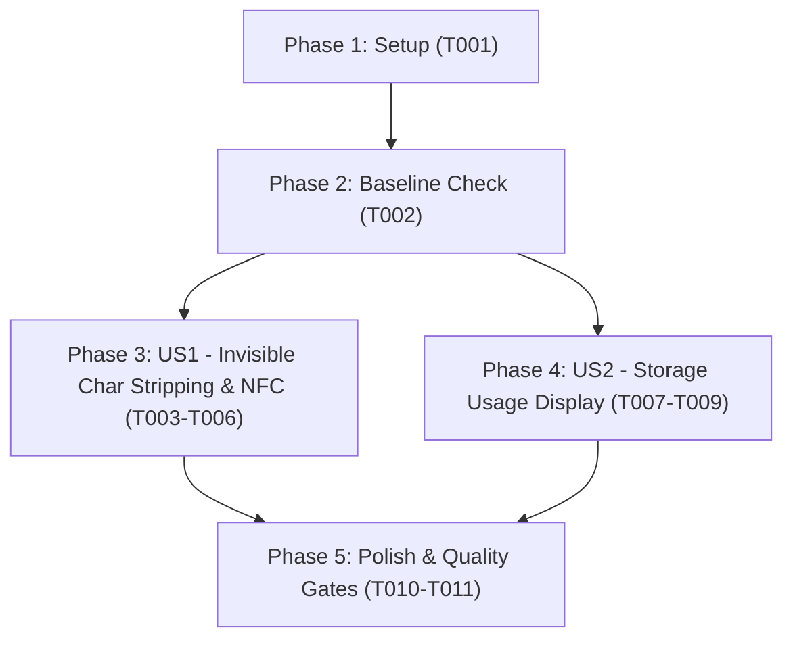

# Tasks: Anti-Scraping Invisible Character Stripping, NFC Normalization & Storage Usage Visibility

**Branch**: `127-textcleaner-storage-estimate`  
**Input Documents**: [`spec.md`](./spec.md), [`plan.md`](./plan.md), [`data-model.md`](./data-model.md), [`contracts/cleaner-and-storage.contract.md`](./contracts/cleaner-and-storage.contract.md), [`research.md`](./research.md), [`quickstart.md`](./quickstart.md)

---

## Phase 1: Setup (Shared Infrastructure)

**Purpose**: Target file audit and baseline workspace verification

- [X] T001 Verify workspace files and clean working tree in src/utils/textCleaner.ts, src/utils/__tests__/textCleaner.test.ts, and src/components/ApiSettings.tsx

---

## Phase 2: Foundational (Blocking Prerequisites)

**Purpose**: Baseline verification of current tests before applying modifications

- [X] T002 Baseline verification of text cleaner and storage tests in src/utils/__tests__/textCleaner.test.ts and src/services/__tests__/db.test.ts

**Checkpoint**: Baseline established. User story implementation can proceed.

---

## Phase 3: User Story 1 - Clean Invisible Anti-Scraping Characters & Enforce Unicode NFC Normalization (Priority: P1) 🎯 MVP

**Goal**: Strip zero-width anti-scraping characters (`\u200B`, `\uFEFF`, `\u200D`, `\u200C`) and normalize text to Unicode NFC in `cleanChineseText`.

**Independent Test**: Run `npx vitest run src/utils/__tests__/textCleaner.test.ts` to verify all anti-scraping and NFC normalization tests pass without regressing title separation or watermark filtering.

### Tests for User Story 1

- [X] T003 [P] [US1] Add unit test cases for zero-width characters stripping and NFC normalization in src/utils/__tests__/textCleaner.test.ts

### Implementation for User Story 1

- [X] T004 [US1] Implement zero-width character stripping for \u200B, \uFEFF, \u200D, and \u200C in src/utils/textCleaner.ts
- [X] T005 [US1] Implement Unicode NFC normalization via .normalize('NFC') in src/utils/textCleaner.ts
- [X] T006 [US1] Verify all unit tests pass in src/utils/__tests__/textCleaner.test.ts

**Checkpoint**: User Story 1 complete. `cleanChineseText` strips all invisible anti-scraping tokens and emits NFC text.

---

## Phase 4: User Story 2 - IndexedDB Storage Usage Transparency in Settings (Priority: P2)

**Goal**: Display local IndexedDB storage usage metrics in the Settings modal with real-time on-mount fetching, manual refresh, and null fallback.

**Independent Test**: Open Settings in the application or run component tests to confirm storage figures are rendered when supported, and hidden (`null`) when unsupported.

### Implementation for User Story 2

- [X] T007 [P] [US2] Create StorageUsageSection subcomponent in src/components/api-settings/StorageUsageSection.tsx
- [X] T008 [US2] Integrate StorageUsageSection into src/components/ApiSettings.tsx
- [X] T009 [US2] Verify settings render and storage estimate error handling in src/services/__tests__/db.test.ts

**Checkpoint**: User Story 2 complete. Storage usage is visible in Settings and handles unsupported browsers gracefully.

---

## Phase 5: Polish & Cross-Cutting Concerns

**Purpose**: Strict scope boundary audit and full quality gate compliance

- [X] T010 [P] Scope boundary audit to verify no unapproved changes to PWA, Web Crypto, Dockerfile, or opencc-js in vite.config.ts
- [X] T011 Run constitutional quality gates (npm run lint, npm test, npm run build) across the repository

---

## Dependencies & Execution Order

### Phase Dependencies

- **Setup (Phase 1)**: Can start immediately.
- **Foundational (Phase 2)**: Depends on T001; verifies initial test suites.
- **User Story 1 (Phase 3)**: Modifies `src/utils/textCleaner.ts` and its test file; independent of User Story 2.
- **User Story 2 (Phase 4)**: Creates `StorageUsageSection.tsx` and updates `ApiSettings.tsx`; independent of User Story 1.
- **Polish (Phase 5)**: Depends on completion of User Story 1 and User Story 2.

### User Story Completion Order

---

## Parallel Opportunities

- **Across Stories**: User Story 1 (`src/utils/*`) and User Story 2 (`src/components/api-settings/*`, `src/components/ApiSettings.tsx`) touch distinct areas and can execute in parallel.
- **Within Stories**:
  - T003 (unit test drafting) and T007 (StorageUsageSection creation) can run in parallel.
  - T010 (scope boundary audit) can run in parallel with final verification.

---

## Implementation Strategy

### MVP First (User Story 1 Only)
1. Complete T001 and T002 (Setup & Baseline).
2. Complete T003 - T006 (Text cleaner zero-width stripping & NFC).
3. Validate text cleaner with Vitest.

### Incremental Delivery
1. Deliver US1 (P1 MVP).
2. Deliver US2 (P2 Storage visualization).
3. Execute Phase 5 quality gates (T010, T011).
