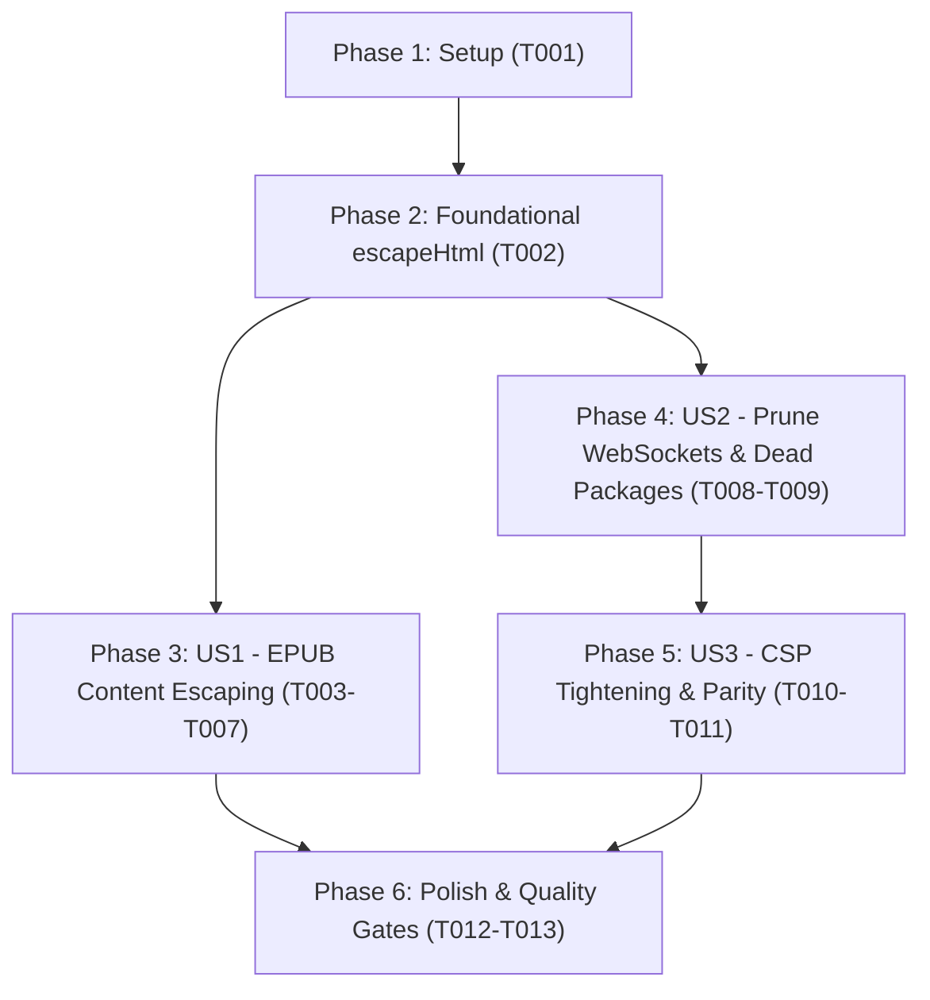

# Tasks: EPUB Export Content Escaping, Dead Protocol Pruning & CSP Hardening

**Branch**: `128-epub-escape-csp-hardening`  
**Input Documents**: [`spec.md`](./spec.md), [`plan.md`](./plan.md), [`data-model.md`](./data-model.md), [`contracts/escape-and-csp.contract.md`](./contracts/escape-and-csp.contract.md), [`research.md`](./research.md), [`quickstart.md`](./quickstart.md)

---

## Phase 1: Setup (Shared Infrastructure)

**Purpose**: Baseline verification of current repository state and test suite

- [X] T001 Verify workspace state and baseline test suite pass status in src/lib/text.ts, src/hooks/useEpubExport.ts, and deployment configs

---

## Phase 2: Foundational (Blocking Prerequisites)

**Purpose**: Core string escaping utility in `src/lib/text.ts` required by User Story 1

- [X] T002 Implement centralized escapeHtml utility function in src/lib/text.ts

**Checkpoint**: Foundation ready — `escapeHtml` is available for all downstream modules.

---

## Phase 3: User Story 1 - Secure and Well-Formed EPUB Document Generation (Priority: P1) 🎯 MVP

**Goal**: Centralize HTML escaping, refactor existing call sites, and escape all user content inside EPUB XML/XHTML containers.

**Independent Test**: Generate EPUB files from novel metadata and chapters containing XML delimiters (`<`, `>`, `&`, `"`, `'`). Verify that all XML/XHTML files within the EPUB container parse cleanly as well-formed documents without throwing XML syntax errors.

### Tests for User Story 1

- [X] T003 [P] [US1] Add unit test cases for escapeHtml and EPUB XML well-formedness in src/lib/__tests__/text.test.ts and src/hooks/__tests__/useEpubExport.test.ts

### Implementation for User Story 1

- [X] T004 [P] [US1] Refactor src/components/auto-translator/DiffModal.tsx to import and use shared escapeHtml from src/lib/text.ts
- [X] T005 [P] [US1] Refactor src/services/zuminovelPublishService.ts to import and use shared escapeHtml from src/lib/text.ts
- [X] T006 [US1] Update src/hooks/useEpubExport.ts to escape all dynamic content in cover.xhtml, chapter XHTML files, nav.xhtml, toc.ncx, and content.opf, escaping proj.description before converting newlines to  
- [X] T007 [US1] Verify EPUB export, DiffModal, and ZumiNovel tests pass in src/hooks/__tests__/useEpubExport.test.ts and src/services/__tests__/zuminovelPublishService.test.ts

**Checkpoint**: User Story 1 complete. EPUB export and publishing pipelines generate strictly well-formed, escaped markup.

---

## Phase 4: User Story 2 - Elimination of Stale WebSocket Directives and Dead Dependencies (Priority: P2)

**Goal**: Prune `ws:` and `wss:` from CSP across all 3 files and remove `y-websocket` and `y-protocols` from `package.json`.

**Independent Test**: Verify that `ws:` and `wss:` are completely absent from `connect-src` in `render.yaml`, `vercel.json`, and `public/_headers`. Verify that `package.json` no longer lists `y-websocket` or `y-protocols`, and that `npm run build` succeeds without missing package errors.

### Implementation for User Story 2

- [X] T008 [P] [US2] Remove y-websocket and y-protocols from dependencies in package.json and run npm install to update package-lock.json
- [X] T009 [US2] Remove ws: and wss: from connect-src in render.yaml, vercel.json, and public/_headers while synchronizing base CSP directives

**Checkpoint**: User Story 2 complete. Stale WebSocket attack surfaces and dead dependencies removed.

---

## Phase 5: User Story 3 - Controlled CSP Inline Tightening & Triple-File Parity Enforcement (Priority: P3)

**Goal**: Test removing `'unsafe-inline'` from `script-src` and `style-src` across 4 core browser journeys, record findings, and enforce 100% triple-file parity.

**Independent Test**: Run `npm run preview` and inspect browser DevTools Console across 4 flows: (a) initial page load and JSON-LD, (b) Google GIS auth, (c) Google Drive Picker, and (d) CustomThemeModal. Confirm whether CSP violations are logged, retain the minimally necessary directives with explanatory comments, and verify byte-for-byte CSP parity across all 3 configuration files.

### Implementation for User Story 3

- [X] T010 [US3] Test removing 'unsafe-inline' from script-src and style-src on npm run preview and inspect DevTools Console across the 4 key user workflows
- [X] T011 [US3] Finalize CSP directives with explanatory comments in render.yaml and enforce 100% byte-for-byte parity across render.yaml, vercel.json, and public/_headers

**Checkpoint**: User Story 3 complete. Content Security Policy is rigorously tested, documented, and synchronized identically across all static deployment targets.

---

## Phase 6: Polish & Cross-Cutting Concerns

**Purpose**: Repository-wide audit, parity verification, and constitutional quality gates

- [X] T012 [P] Verify character-for-character CSP string equality across render.yaml, vercel.json, and public/_headers
- [X] T013 Run constitutional quality gates (npm run lint, npm test, npm run build) across the entire repository

---

## Dependencies & Execution Order

### Phase Dependencies

- **Setup (Phase 1)**: Can start immediately.
- **Foundational (Phase 2)**: Depends on T001; implements centralized `escapeHtml`.
- **User Story 1 (Phase 3)**: Depends on T002; updates EPUB export, DiffModal, and ZumiNovel call sites.
- **User Story 2 (Phase 4)**: Independent of User Story 1; removes dead packages and WebSocket CSP directives.
- **User Story 3 (Phase 5)**: Depends on completion of User Story 2 CSP baseline; performs empirical browser validation.
- **Polish (Phase 6)**: Depends on completion of User Story 1, 2, and 3.

### User Story Completion Order

---

## Parallel Opportunities

- **Across Stories**:
  - User Story 1 (touching `src/lib/`, `src/hooks/`, `src/components/`, `src/services/`) and User Story 2 (touching `package.json`, `render.yaml`, `vercel.json`, `public/_headers`) touch disjoint files and can execute in parallel.
- **Within Stories**:
  - T003 (unit test drafting), T004 (`DiffModal.tsx` refactor), and T005 (`zuminovelPublishService.ts` refactor) can execute in parallel once T002 is complete.
  - T008 (`package.json` package removal) and T009 (CSP pruning) can run in parallel.
  - T012 (parity verification script) can run in parallel before final build.

---

## Implementation Strategy

### MVP First (User Story 1 Only)
1. Complete T001 and T002 (Setup & Foundational `escapeHtml`).
2. Complete T003 - T007 (EPUB export escaping & regression testing).
3. Validate EPUB XML well-formedness with Vitest.

### Incremental Delivery
1. Deliver US1 (P1 MVP: Well-formed EPUB export).
2. Deliver US2 (P2: Dead package & WebSocket cleanup).
3. Deliver US3 (P3: Empirical CSP tightening & triple-file sync).
4. Execute Phase 6 quality gates (T012, T013).
