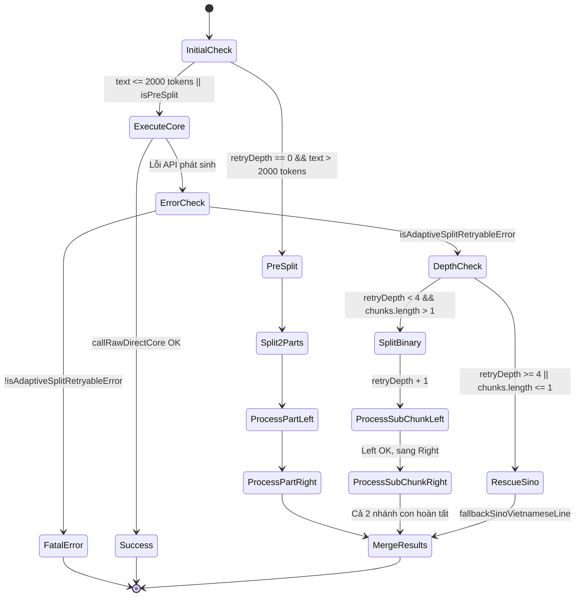

# Data Model: Binary Split Max Depth 4 & Isolated Sub-branch Recursion

**Feature Branch**: `132-binary-split-max-depth-4`  
**Date**: 2026-09-13  
**Spec**: [spec.md](./spec.md)

---

## 1. Entity Schema & Types

### Binary Chunk Node (Nút Phân Đoạn Nhị Phân)
Mô hình hóa một phân đoạn văn bản trong cây chia đôi đệ quy:

```typescript
export interface BinaryChunkNode {
  /** Định danh duy nhất hoặc chỉ số phân đoạn trong cây */
  id: string;
  /** Độ sâu đệ quy hiện tại (0 <= retryDepth <= 4) */
  retryDepth: number;
  /** Nội dung văn bản tiếng Trung cần dịch */
  text: string;
  /** Văn bản dịch thô tương ứng (sử dụng trong Giai đoạn 2 Chuốt văn) */
  rawTranslation?: string;
  /** Trạng thái xử lý của phân đoạn */
  status: 'PENDING' | 'SUCCESS' | 'RETRYING' | 'RESCUED';
  /** Kết quả dịch sau khi hoàn tất */
  translatedText?: string;
  /** Thực thể thuật ngữ phát hiện được trong phân đoạn */
  discoveredEntities?: any[];
  /** Chỉ số khóa API thành công sau cùng */
  successKeyIndex?: number;
}
```

### Split Retry Event Metadata (`SplitRetryInfo`)
Cấu trúc thông tin sự kiện phát đi qua callback `onSplitRetry` để UI hiển thị chẩn đoán:

```typescript
export interface SplitRetryInfo {
  /** Giai đoạn dịch: 'raw' (dịch thô) hoặc 'polish' (chuốt văn phong) */
  stage: 'raw' | 'polish';
  /** Độ sâu đệ quy hiện tại (0, 1, 2, 3) */
  depth: number;
  /** Số phần con được chia nhỏ (luôn bằng 2 khi đệ quy nhị phân, hoặc 1 khi cứu nguy) */
  partsCount: number;
  /** Nguyên nhân kích hoạt thử lại (UNTRANSLATED_CHINESE_LEFTOVER, SAFETY, ...) */
  reason: string;
  /** Tầng cứu nguy: 'split' (chia đôi đệ quy) hoặc 'sino-fallback' (cứu nguy Hán-Việt) */
  tier: 'split' | 'sino-fallback';
}
```

---

## 2. State Machine & Execution Transitions

### Vòng đời phân đoạn trong Giai đoạn 1 (Dịch thô)



---

## 3. Quy tắc bảo toàn dữ liệu & Cô lập nhánh lỗi

1. **Nguyên tắc cô lập nhánh**:
   - Khi `chunkLeft` thành công: Kết quả `translatedChunks[0]` được đóng băng.
   - Nếu `chunkRight` thất bại: Hàm chỉ gọi đệ quy `rawWithContentSplitDirect(chunkRight, retryDepth + 1)`.
   - Cây con của `chunkRight` tự xử lý chia đôi độc lập mà không ảnh hưởng tới `chunkLeft`.
2. **Nguyên tắc ghép nối thứ tự (In-order Preservation)**:
   - Tại mọi nút phân chia: `result = separateChapterTitleAndBody([leftResult, rightResult].join('\n\n').trim())`.
   - Đảm bảo tính giao hoán và kết hợp thứ tự tuyến tính của văn bản.
3. **Nguyên tắc an toàn tối hậu**:
   - Khi chạm trần `retryDepth >= 4`, nhánh đó **không ném ngoại lệ**, mà chuyển sang phiên âm Hán-Việt kết hợp từ điển.
   - Nhờ đó, một nhánh con bị lỗi từ ngữ nhạy cảm chỉ bị ảnh hưởng cục bộ trên phạm vi vài câu của chính nó, các nhánh con khác vẫn giữ nguyên bản dịch AI chất lượng cao.
