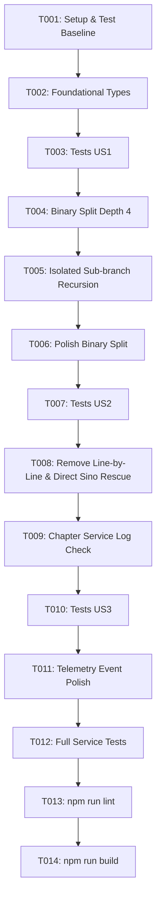

# Tasks: Mở Rộng Độ Sâu Đệ Quy Lên 4 Cấp, Phân Đôi Nhị Phân & Cô Lập Nhánh Lỗi (132-binary-split-max-depth-4)

**Input**: Implementation plan from `specs/132-binary-split-max-depth-4/plan.md`  
**Prerequisites**: `spec.md`, `plan.md`, `research.md`, `data-model.md`, `contracts/`  

---

## Phase 1: Setup (Shared Infrastructure)

**Purpose**: Chuẩn bị môi trường và kiểm tra trạng thái kiểm thử trước khi triển khai

- [X] T001 [P] Review existing directTranslationEngine test baseline in src/services/__tests__/directTranslationEngine.test.ts

---

## Phase 2: Foundational (Blocking Prerequisites)

**Purpose**: Chuẩn hóa kiểu dữ liệu hợp đồng cho độ sâu đệ quy 4 cấp và sự kiện thử lại

- [X] T002 Update SplitRetryInfo interface in src/services/directTranslationEngine.ts to support depth up to 4 and pure binary retry info

**Checkpoint**: Kiểu dữ liệu sẵn sàng - bắt đầu triển khai các User Stories

---

## Phase 3: User Story 1 - Tự động chia đôi đệ quy sâu đến 4 cấp & Cô lập nhánh lỗi (Priority: P1) 🎯 MVP

**Goal**: Nâng trần đệ quy lên độ sâu 4 cấp (`depth` 0 -> 3), áp dụng chia đôi nhị phân (`partsCount = 2`) ở mọi cấp, cô lập lỗi theo từng nhánh con độc lập (không dịch lại các phân đoạn đã thành công) và gộp kết quả tuần tự theo đúng trật tự ban đầu.

**Independent Test**:
- Chạy unit test mô phỏng văn bản gồm 4 đoạn mà đoạn 3 lỗi. Xác nhận đoạn 1, 2, 4 chỉ được gọi API đúng 1 lần; chỉ đoạn 3 được đệ quy chia đôi; kết quả cuối cùng gộp đủ 4 đoạn theo đúng thứ tự.

### Tests for User Story 1

- [X] T003 [P] [US1] Unit tests for pure binary split and isolated sub-branch recursion in src/services/__tests__/directTranslationEngine.test.ts

### Implementation for User Story 1

- [X] T004 [US1] Refactor rawWithContentSplitDirect in src/services/directTranslationEngine.ts to use pure binary split (partsCount = 2) up to depth 4
- [X] T005 [US1] Implement isolated sub-branch recursion and in-order result assembly in src/services/directTranslationEngine.ts
- [X] T006 [US1] Update polishWithContentSplitDirect in src/services/directTranslationEngine.ts to support pure binary split up to depth 4

**Checkpoint**: User Story 1 hoạt động hoàn chỉnh độc lập - bản dịch thô và chuốt tự động chia đôi sâu tới 4 cấp và cô lập nhánh lỗi.

---

## Phase 4: User Story 2 - Loại bỏ phân rã từng dòng & Cứu nguy phân đoạn tại trần độ sâu 4 (Priority: P2)

**Goal**: Xóa bỏ hoàn toàn Tier 2 (Line-by-Line Fallback), loại bỏ việc gửi API từng dòng khi chạm trần phân đoạn; chuyển thẳng sang cứu nguy Hán-Việt kết hợp từ điển trực tiếp trên phân đoạn tại `depth >= 4`.

**Independent Test**:
- Chạy test giả lập văn bản luôn gây lỗi qua cả 4 cấp đệ quy. Xác nhận không có sự kiện `tier: 'line-by-line'`, xuất hiện sự kiện `tier: 'sino-fallback'`, và chương truyện không bị sập.

### Tests for User Story 2

- [X] T007 [P] [US2] Unit tests for removal of line-by-line fallback and direct Sino-fallback rescue at depth >= 4 in src/services/__tests__/directTranslationEngine.test.ts

### Implementation for User Story 2

- [X] T008 [US2] Remove Tier 2 line-by-line fallback loop and trigger direct fallbackSinoVietnameseLine rescue at depth >= 4 in src/services/directTranslationEngine.ts
- [X] T009 [US2] Verify chapterTranslationService.ts log compatibility for sino-fallback and split tiers in src/services/chapterTranslationService.ts

**Checkpoint**: User Story 1 và 2 đều hoạt động độc lập - không còn bất kỳ request đơn dòng nào phát sinh khi chạm trần phân đoạn.

---

## Phase 5: User Story 3 - Giám sát tiến trình đệ quy nhị phân theo thời gian thực (Priority: P3)

**Goal**: Cung cấp thông tin chẩn đoán chính xác qua callback `onSplitRetry` (phản ánh độ sâu thực tế từ 0 đến 3, tỷ lệ chia đôi `partsCount = 2` và tầng cứu nguy).

**Independent Test**:
- Kiểm tra các sự kiện `onSplitRetry` thu thập được trong quá trình đệ quy mang đúng metadata `depth`, `partsCount = 2`, và `tier`.

### Tests for User Story 3

- [X] T010 [P] [US3] Unit tests verifying onSplitRetry emission with accurate depth (0-3), partsCount = 2, and tier metadata in src/services/__tests__/directTranslationEngine.test.ts

### Implementation for User Story 3

- [X] T011 [US3] Ensure onSplitRetry callbacks emit accurate depth and tier metadata in src/services/directTranslationEngine.ts

**Checkpoint**: Toàn bộ hệ thống giám sát tiến trình đệ quy nhị phân được cập nhật đồng bộ.

---

## Phase 6: Polish & Cross-Cutting Concerns

**Purpose**: Đảm bảo chất lượng toàn diện, loại trừ lỗi hồi quy và tuân thủ nguyên tắc Hiến pháp dự án.

- [X] T012 Run full test suite via npm test src/services/__tests__/
- [X] T013 Run type check via npm run lint
- [X] T014 Run build verification via npm run build

---

## Dependencies & Execution Order

### Parallel Opportunities

- **T001** (Setup review) có thể chạy độc lập.
- **T003**, **T007**, **T010** (Unit tests) có thể chuẩn bị song song trước khi hoàn tất phần logic tương ứng.
- **T004** và **T006** tác động vào 2 hàm riêng biệt (`rawWithContentSplitDirect` và `polishWithContentSplitDirect`) trong cùng file.

---

## Implementation Strategy

### MVP First (User Story 1 Only)
1. Hoàn thành **T001** và **T002**.
2. Viết kiểm thử **T003** và triển khai **T004**, **T005**, **T006**.
3. **Xác thực MVP**: Chạy `npm test src/services/__tests__/directTranslationEngine.test.ts` để chứng minh cơ chế chia đôi 4 cấp và cô lập nhánh lỗi đã hoạt động hoàn hảo.

### Giao Hàng Gia Tăng (Incremental Delivery)
1. Thêm **User Story 2** (**T007 - T009**): Cắt bỏ triệt để Tier 2 Line-by-line fallback, hoàn thiện tầng cứu nguy Hán-Việt trực tiếp.
2. Thêm **User Story 3** (**T010 - T011**): Kiểm tra và hoàn thiện telemetry sự kiện thử lại.
3. Hoàn tất **Phase 6** (**T012 - T014**): Chạy toàn bộ test suite, lint và build theo đúng quy định Constitution.
