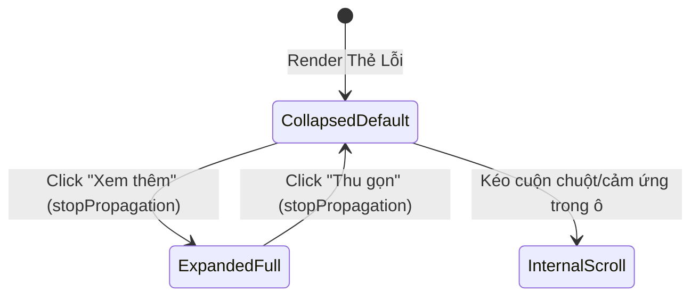

# Phase 1 Data Model & UI State: Khắc Phục Lỗi Bị Che Chữ & Cho Phép Cuộn Xem Đầy Đủ Thẻ Lỗi Thẩm Định Chất Lượng (133-fix-audit-overflow)

## 1. Thực Thể Dữ Liệu Cốt Lõi (Core Entity - Unchanged)

Thực thể `UnifiedAuditIssue` được định nghĩa tại `src/types/audit.ts` và được giữ nguyên tính bất biến (tuân thủ Nguyên tắc Hiến pháp IV):

```typescript
export interface UnifiedAuditIssue {
  id: string;                                   // Định danh duy nhất của lỗi
  title: string;                                // Tiêu đề ngắn gọn mô tả vấn đề
  message: string;                              // Nội dung chi tiết giải thích lỗi
  severity: UnifiedSeverity;                    // Mức độ nghiêm trọng ('error' | 'warning' | 'info')
  source: UnifiedSource;                        // Nguồn phát hiện ('hako_rule' | 'ai_critique')
  targetText?: string;                          // Đoạn văn bản trích dẫn làm bằng chứng (có thể rất dài)
  status: 'pending' | 'resolved';               // Trạng thái xử lý
  autoFixable?: boolean;                        // Khả năng tự động sửa nhanh
  suggestion?: string;                          // Đoạn văn bản đề xuất thay thế
  category?: string;                            // Danh mục lỗi theo quy chuẩn Hako
  chapterId?: string;                           // Mã chương truyện tương ứng
  chapterNumber?: number;                       // Số thứ tự chương
}
```

---

## 2. Trạng Thái Giao Diện Cục Bộ (Local UI State Model)

Trạng thái điều khiển mở rộng và cuộn nội dung trong `UnifiedAuditPanel`:

```typescript
/**
 * Tập hợp các ID của issue đang được người dùng bấm mở rộng trích đoạn toàn văn
 */
const [expandedSnippetIds, setExpandedSnippetIds] = useState<Set<string>>(new Set());

/**
 * Ngưỡng độ dài ký tự kích hoạt nút "Xem thêm / Thu gọn"
 */
export const SNIPPET_EXPAND_THRESHOLD = 120;
```

### Chuyển Dịch Trạng Thái (State Transitions)



- **Mặc định (`CollapsedDefault`)**:
  - Trích đoạn áp dụng `max-h-28 overflow-y-auto break-words whitespace-pre-wrap select-text`.
  - Nếu `issue.targetText.length > SNIPPET_EXPAND_THRESHOLD` hoặc chứa ký tự xuống dòng `\n`, hiển thị nút `"Xem thêm"` với icon `ChevronDown`.
- **Mở rộng (`ExpandedFull`)**:
  - Trích đoạn nâng chiều cao tối đa lên `max-h-none` (hoặc `max-h-96 overflow-y-auto`).
  - Nút chuyển sang nhãn `"Thu gọn"` với icon `ChevronUp`.
- **Thao tác cuộn (`InternalScroll`)**:
  - Người dùng có thể lăn chuột hoặc vuốt cảm ứng cuộn lên xuống ngay trong khung trích đoạn mà không bị giới hạn 2 dòng.

---

## 3. Bản Đồ Token Lớp CSS (Styling Token Mapping)

| Phần tử UI | Class Tailwind v4 Trước Đây | Class Tailwind v4 Mới Tối Ưu |
|---|---|---|
| **Vùng trích đoạn (`targetText`)** | `line-clamp-2` (gây lỗi che chữ) | `max-h-28 overflow-y-auto break-words whitespace-pre-wrap select-text cursor-text` (mở rộng: `max-h-none`) |
| **Văn bản giải thích (`message`)** | `text-[11px] text-text-muted leading-relaxed` | `text-[11px] text-text-muted leading-relaxed break-words whitespace-pre-wrap` |
| **Vùng xem trước viết lại (`pendingPreviews`)** | `bg-ink/60 rounded-[2px] px-2 py-1.5 font-mono` | `bg-ink/60 rounded-[2px] px-2 py-1.5 font-mono max-h-36 overflow-y-auto break-words whitespace-pre-wrap select-text` |
| **Danh sách thẻ lỗi (`Container`)** | `space-y-2 max-h-80 overflow-y-auto pr-1` | `space-y-2 max-h-[28rem] overflow-y-auto pr-1.5 scrollbar-thin` |
