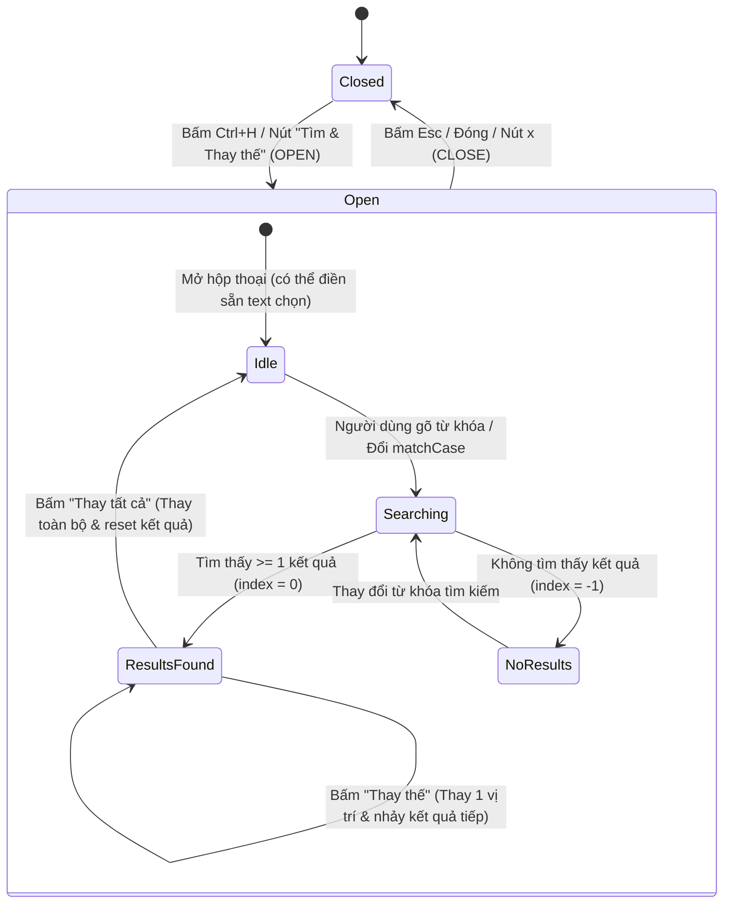

# Data Model: Tìm và Thay Thế Văn Bản Trong Bàn Dịch (136-find-and-replace)

**Feature**: `136-find-and-replace` | **Date**: 2026-09-14

---

## 1. Entities & Types

### 1.1 `MatchLocation`
Vị trí tọa độ của một kết quả tìm kiếm trùng khớp trong chuỗi văn bản.

```typescript
export interface MatchLocation {
  /** Chỉ số ký tự bắt đầu trong văn bản (0-indexed) */
  start: number;
  /** Chỉ số ký tự kết thúc trong văn bản (exclusive) */
  end: number;
}
```

### 1.2 `FindReplaceState`
Trạng thái quản lý của hộp thoại và luồng tìm kiếm thay thế.

```typescript
export interface FindReplaceState {
  /** Trạng thái hiển thị của hộp thoại Tìm và Thay thế */
  isOpen: boolean;
  /** Chuỗi văn bản cần tìm */
  searchTerm: string;
  /** Chuỗi văn bản dùng để thay thế */
  replaceTerm: string;
  /** Tùy chọn phân biệt chữ hoa/thường */
  matchCase: boolean;
  /** Danh sách tất cả các vị trí trùng khớp tìm được */
  matches: MatchLocation[];
  /** Vị trí kết quả hiện tại đang được bôi chọn (-1 nếu không có kết quả) */
  currentMatchIndex: number;
}
```

### 1.3 `FindReplaceAction`
Các hành động điều khiển trạng thái tìm kiếm và thay thế.

```typescript
export type FindReplaceAction =
  | { type: 'OPEN'; initialSearch?: string }
  | { type: 'CLOSE' }
  | { type: 'SET_SEARCH_TERM'; term: string; matches: MatchLocation[] }
  | { type: 'SET_REPLACE_TERM'; term: string }
  | { type: 'SET_MATCH_CASE'; matchCase: boolean; matches: MatchLocation[] }
  | { type: 'SET_MATCH_INDEX'; index: number }
  | { type: 'NEXT_MATCH' }
  | { type: 'PREV_MATCH' }
  | { type: 'RESET' };
```

---

## 2. State Transition Machine (Vòng đời trạng thái)



---

## 3. Nguyên Tắc Toàn Vẹn Dữ Liệu (Data Integrity)

1. **Bất biến của Text Nguồn (Source Text)**:
   - Thao tác Tìm và Thay thế chỉ áp dụng trên văn bản dịch của phân vùng đang chọn (`rawTranslation` hoặc `polishedTranslation`). Tuyệt đối không làm thay đổi bản gốc tiếng Trung (`sourceText`) trừ khi có hành động chỉ định riêng.
2. **Nguyên tử hóa khi Thay tất cả (Atomic Batch Replace)**:
   - Toàn bộ các vị trí tìm kiếm được thay thế cùng lúc trong 1 lần cập nhật state duy nhất, bảo đảm không bị lỗi lặp vô hạn hay phân mảnh văn bản.
3. **Đồng bộ hóa với CRDT / Lịch sử hoàn tác**:
   - Sau khi thay thế, giá trị mới được chuyển vào setter của stage tương ứng, kích hoạt đồng bộ hóa tự động qua CRDT (nếu có phiên cộng tác) và cho phép người dùng lưu chương bằng `Ctrl+S`.
