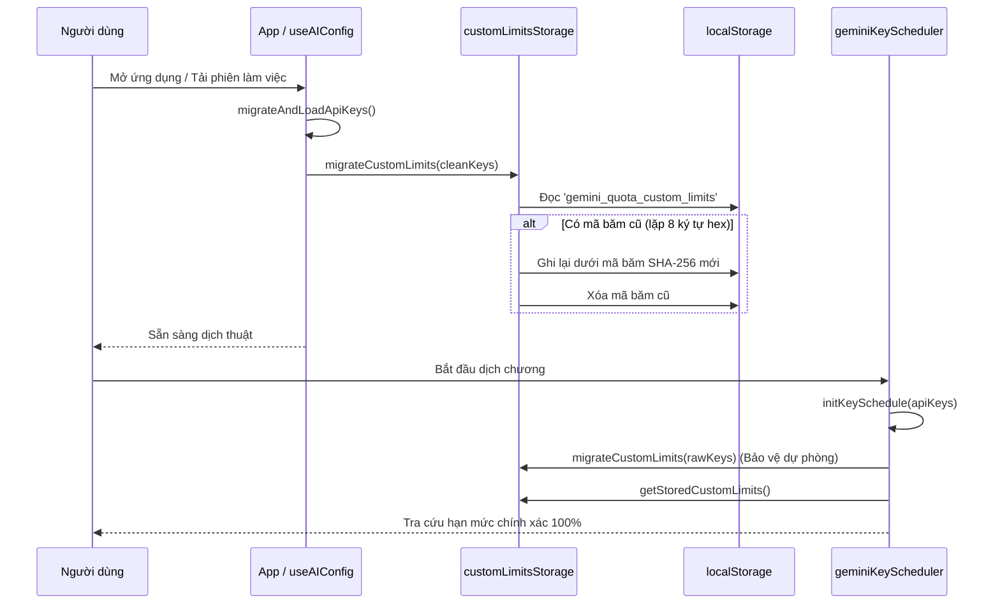
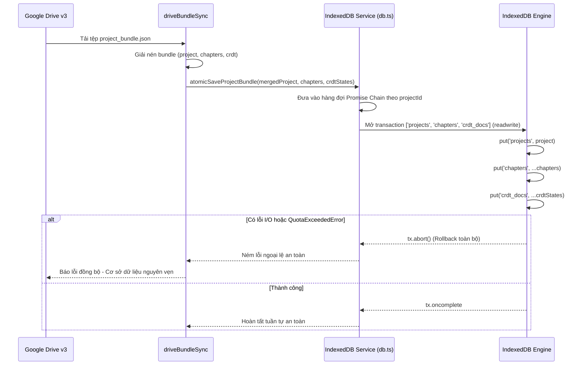

# Data Model: Kích Hoạt Di Trú Hạn Mức Runtime, Nhất Quán Lưu Trữ Drive & Phân Đoạn Theo Ngân Sách Token (140-runtime-migration-drive-consistency)

**Feature**: `140-runtime-migration-drive-consistency`  
**Date**: 2026-09-15  
**Spec**: [spec.md](./spec.md) | **Research**: [research.md](./research.md)

---

## 1. Mô Hình Thực Thể (Entity Models)

### 1.1 AtomicProjectBundleInput (Gói Lưu Trữ Đa Store Nguyên Tử)

Đại diện cho dữ liệu đầu vào của một giao dịch cập nhật nguyên tử trên IndexedDB cho một dự án, bao gồm metadata dự án, toàn bộ nội dung chương và các trạng thái CRDT đồng bộ.

```typescript
export interface AtomicProjectBundleInput {
  /** Thông tin metadata của dự án (Store: 'projects') */
  project: StoryProject;
  /** Danh sách các chương cần lưu đồng thời (Store: 'chapters') */
  chapters: Chapter[];
  /** Danh sách trạng thái nhị phân CRDT tùy chọn tương ứng từng chương (Store: 'crdt_docs') */
  crdtStates?: Array<{
    chapterId: string;
    state: Uint8Array;
  }>;
}
```

**Ràng buộc dữ liệu & Toàn vẹn**:
- `project.id` không được rỗng.
- Tất cả `chapter.projectId` trong mảng `chapters` phải khớp với `project.id`.
- Mọi thao tác ghi phải hoàn tất trên cùng một `IDBTransaction` với scope `['projects', 'chapters', 'crdt_docs']`. Nếu bất kỳ thao tác nào thất bại, transaction kích hoạt `abort()` tự động.

---

### 1.2 CustomLimitMigrationState (Trạng Thái Di Trú Hạn Mức Runtime)

Đại diện cho kết quả kiểm tra và di trú cấu hình hạn mức từ mã băm cũ sang chuẩn SHA-256.

```typescript
export interface CustomLimitMigrationState {
  /** Số lượng mục cấu hình đã chuyển đổi thành công sang SHA-256 */
  migratedCount: number;
  /** Số lượng mục cấu hình cũ còn lại chưa thể di trú (thiếu pre-image) */
  legacyCount: number;
  /** Tổng số mục cấu hình hiện tại trong kho lưu trữ */
  currentCount: number;
  /** Danh sách các mã băm SHA-256 mới đã được tạo */
  migratedKeys: string[];
}
```

---

### 1.3 TokenWeightedSplitOptions (Cấu Hình Phân Đoạn Theo Trọng Số Token)

Mở rộng `BilingualSplitOptions` hỗ trợ gom đoạn lũy kế theo ngân sách token.

```typescript
export interface TokenWeightedSplitOptions {
  /** Văn bản nguồn (tiếng Trung) */
  sourceText: string;
  /** Văn bản thô (tiếng Việt) */
  rawText: string;
  /** Số phần chia mục tiêu mặc định khi không truyền maxTokensPerChunk */
  targetParts?: number;
  /** Giới hạn token tối đa cho mỗi chunk */
  maxTokensPerChunk?: number;
}
```

---

## 2. Vòng Đời & Luồng Dữ Liệu (Lifecycle & State Flow)

### 2.1 Luồng Khởi Động & Di Trú Hạn Mức Runtime



### 2.2 Luồng Giao Dịch Nguyên Tử Khi Kéo Gói Từ Google Drive


