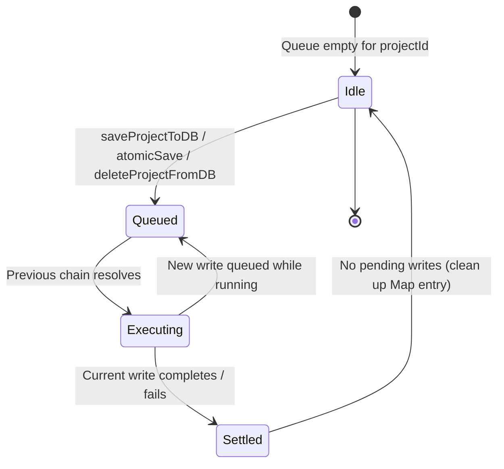
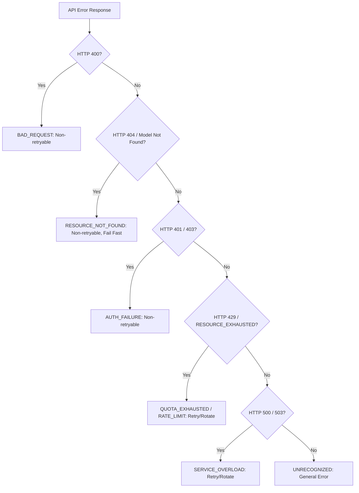

# Data Model & Storage Schema: Storage Security & Consistency Hardening

**Feature**: `141-storage-and-credential-hardening`  
**Date**: 2026-09-17  
**Status**: Completed  

---

## 1. Storage Domain Entities & Authority Mapping

| Entity | Primary Store | Storage Scope | Authority | Eviction / Retention |
| :--- | :--- | :--- | :--- | :--- |
| **StoryProject** | IndexedDB (`projects`) | Persistent Client | Authoritative Single Source of Truth | Manual User Delete / Drive Sync |
| **Chapter** | IndexedDB (`chapters`) | Persistent Client | Authoritative Single Source of Truth | Cascade Delete with Project |
| **CRDT State** | IndexedDB (`crdt_states`) | Persistent Client | Authoritative Single Source of Truth | Cascade Delete with Project |
| **Active API Keys** | `sessionStorage['gemini_api_keys']` | Tab/Session Ephemeral | Runtime Authoritative | Cleared when browser tab closes |
| **Remembered Keys** | `localStorage['app_ui_prefs'].savedKeys` | Persistent Browser | User-Controlled Preference | Persisted ONLY when `rememberKeys === true` |
| **UI Preferences** | `localStorage['app_ui_prefs']` | Persistent Browser | Client Preference Store | Retained until manual reset |
| **Quota Metrics** | `ReactMemory` / `LocalQuotaTracker` | Runtime Ephemeral | In-memory Tracker | Resets on reload; daily PST window |

---

## 2. IndexedDB Schema Formalization

The canonical IndexedDB database is named `novel_translator_db` (version 4+).

### Stores:
1. **`projects`**:
   - Primary Key: `id` (string, UUID or slug)
   - Indexes: `updatedAt`
   - Fields:
     ```ts
     interface StoryProject {
       id: string;
       title: string;
       originalLanguage: 'zh' | 'ja';
       targetLanguage: 'vi';
       chapters: ChapterMetadata[];
       glossary?: GlossaryEntry[];
       createdAt: string;
       updatedAt: string;
       storageFormat?: 'monolithic' | 'bundle';
     }
     ```

2. **`chapters`**:
   - Primary Key: `id` (string)
   - Indexes: `projectId`
   - Fields:
     ```ts
     interface Chapter {
       id: string;
       projectId: string;
       title: string;
       sourceText: string;
       rawTranslation?: string;
       polishedTranslation?: string;
       status: ChapterStatus;
       createdAt: string;
       updatedAt: string;
     }
     ```

3. **`crdt_states`** *(Canonical Store Name)*:
   - Primary Key: `chapterId` (string)
   - Indexes: `projectId`
   - Fields:
     ```ts
     interface CrdtStateRecord {
       chapterId: string;
       projectId: string;
       state: Uint8Array;
       updatedAt: string;
     }
     ```
   - *Note on Legacy Compatibility*: Pre-existing IndexedDB versions may contain a store named `crdt_docs`. Database initialization and bundle operations detect both `crdt_states` (preferred) and `crdt_docs` (fallback).

---

## 3. Storage Queue State Machine

### Per-Project Write Serialization Queue


### Invariant Rules:
1. **FIFO per Project**: Any call to `saveProjectToDB`, `atomicSaveProjectBundle`, or `deleteProjectFromDB` for project `X` is appended to `projectWriteChains.get(X)`.
2. **Resurrection Prevention**: If a delete arrives while a save is queued or executing, the delete promise is chained onto the end of the existing chain, guaranteeing it executes *after* the save.
3. **Map Cleanup**: When `nextChain` finishes execution:
   ```ts
   if (projectWriteChains.get(projectId) === nextChain) {
     projectWriteChains.delete(projectId);
   }
   ```
   This ensures that inactive project IDs do not leak memory in the Map.

---

## 4. Credential Storage & Audit Invariant

### `app_ui_prefs` JSON Schema in `localStorage`:
```json
{
  "rememberKeys": true,
  "savedKeys": ["AIzaSy..."],
  "theme": "dark",
  "warning_paragraph_mismatch": true
}
```

### State Transitions:
1. **User enters keys with `rememberKeys = true` (default)**:
   - `sessionStorage['gemini_api_keys']` = `JSON.stringify(cleanKeys)`
   - `localStorage['app_ui_prefs'].savedKeys` = `cleanKeys`
   - `verifyStorageIntegrity()` evaluates: `rememberKeys === true` -> **PASS**
2. **User toggles `rememberKeys = false`**:
   - `localStorage['app_ui_prefs'].rememberKeys` = `false`
   - `localStorage['app_ui_prefs'].savedKeys` = `[]` (cleared immediately)
   - `sessionStorage['gemini_api_keys']` remains untouched (ephemeral session continues)
   - `verifyStorageIntegrity()` evaluates: `rememberKeys === false` && `savedKeys.length === 0` -> **PASS**
3. **Inconsistent / Violation State (`rememberKeys = false` but keys present in `savedKeys`)**:
   - `verifyStorageIntegrity()` evaluates: **FAIL** (Violation logged)
   - `sanitizeLocalStorage()` cleanses `savedKeys: []` -> Restored to **PASS**
4. **Legacy Root Key (`localStorage['gemini_api_keys']`)**:
   - Detected on load: Migrated to `sessionStorage` and deleted from `localStorage`.
   - If present during audit: **FAIL** (Always forbidden).

---

## 5. Gemini Error Classification Hierarchy


