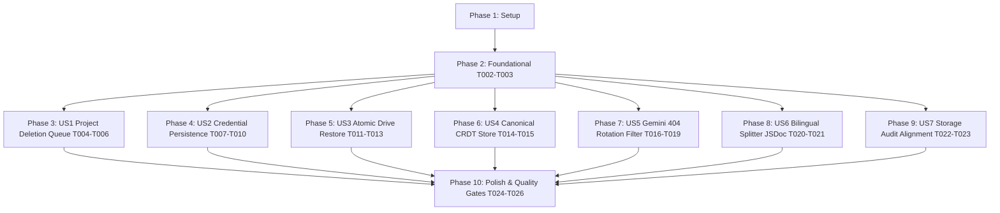

# Tasks: Storage Security and Consistency Hardening

**Feature**: `141-storage-and-credential-hardening`  
**Spec**: [`spec.md`](./spec.md) | **Plan**: [`plan.md`](./plan.md)  
**Status**: Ready for Implementation  

---

## Phase 1: Setup & Pre-Flight Checks

**Purpose**: Baseline verification of current repository state and test harness

- [x] T001 Verify baseline repo state, test suite, and lint gates via `npm run lint` and `npm test`

---

## Phase 2: Foundational (Blocking Prerequisites)

**Purpose**: Core queue serialization and memory management in IndexedDB service layer

- [x] T002 Implement serialized queueing for `deleteProjectFromDB` on `projectWriteChains.get(id)` in `src/services/db.ts`
- [x] T003 Implement cleanup of settled promise references from `projectWriteChains` Map in `src/services/db.ts`

---

## Phase 3: User Story 1 - Queue-Serialized Project Deletion & Resurrection Guard (Priority: P1) 🎯 MVP

**Goal**: Ensure project deletion is queued behind pending saves for the same project ID, eliminating project resurrection race conditions and queue memory leaks.  
**Independent Test**: Simulate concurrent save and delete on the same project; verify project is completely removed from IndexedDB and `projectWriteChains` Map entry is cleaned up.

### Tests for User Story 1

- [x] T004 [P] [US1] Create unit and race condition tests in `src/services/__tests__/projectDeleteQueue.test.ts`

### Implementation for User Story 1

- [x] T005 [US1] Ensure `handleDeleteProject` in `src/hooks/useProjects.ts` safely coordinates with serialized queueing
- [x] T006 [US1] Run and verify `src/services/__tests__/projectDeleteQueue.test.ts` and `src/services/__tests__/projectWriteQueue.test.ts` pass cleanly

---

## Phase 4: User Story 2 - User-Controlled Key Persistence & Storage Audit Consistency (Priority: P1)

**Goal**: Retain `rememberKeys` as an explicit user toggle (default: ON) that persists keys in `app_ui_prefs.savedKeys`. Instantly wipe keys from `localStorage` when toggled OFF. Update `storageAudit.ts` to recognize this policy and validate violations only when `rememberKeys === false`.  
**Independent Test**: Verify keys persist in `app_ui_prefs.savedKeys` when `rememberKeys === true`, clear instantly when `rememberKeys === false`, and `verifyStorageIntegrity()` reports valid when enabled and flags violation when disabled with keys present.

### Tests for User Story 2

- [x] T007 [P] [US2] Update and add comprehensive credential persistence tests in `src/utils/__tests__/credentialStorage.test.ts`

### Implementation for User Story 2

- [x] T008 [US2] Update `src/hooks/useAIConfig.ts` to ensure `app_ui_prefs.savedKeys` is emptied (`[]`) when `rememberKeys === false` and scrubbed on application load
- [x] T009 [US2] Update `src/utils/storageAudit.ts` to inspect `app_ui_prefs.savedKeys`, allow keys when `rememberKeys !== false`, flag violations when `rememberKeys === false`, and cleanse via `sanitizeLocalStorage`
- [x] T010 [US2] Run and verify `src/utils/__tests__/credentialStorage.test.ts` and `src/components/__tests__/KeyListSectionLagFix.test.ts` pass cleanly

---

## Phase 5: User Story 3 - Atomic Google Drive Legacy Restore (Priority: P2)

**Goal**: Ensure `pullAllFromDrive()` in monolithic mode downloads both project metadata and chapter payloads before committing them together in a single atomic transaction via `atomicSaveProjectBundle()`.  
**Independent Test**: Simulate download failure during chapter retrieval; verify IndexedDB remains completely untouched with 0 partial writes.

### Tests for User Story 3

- [x] T011 [P] [US3] Create atomic monolithic pull tests in `src/services/google-drive/__tests__/driveLegacyPullAtomic.test.ts`

### Implementation for User Story 3

- [x] T012 [US3] Refactor monolithic pull logic in `src/services/google-drive/driveProjectSync.ts` to use `atomicSaveProjectBundle()`
- [x] T013 [US3] Run and verify `src/services/google-drive/__tests__/driveLegacyPullAtomic.test.ts` passes cleanly

---

## Phase 6: User Story 4 - Canonical CRDT Store Name Standardization (Priority: P2)

**Goal**: Standardize on `crdt_states` as the sole canonical store name across all specifications, contracts, and codebases, retaining `crdt_docs` strictly as an obsolete fallback.  
**Independent Test**: Verify documentation, contracts, and database initialization use `crdt_states` as primary.

### Implementation for User Story 4

- [x] T014 [P] [US4] Update documentation in `docs/model-system.md` to establish `crdt_states` as canonical store name
- [x] T015 [US4] Confirm canonical store lookup precedence (`crdt_states` primary, `crdt_docs` fallback) in `src/services/db.ts`

---

## Phase 7: User Story 5 - Non-Credential Error Fast-Fail & Key Rotation Filtering (Priority: P2)

**Goal**: Classify HTTP 404 from Gemini API as non-retryable `RESOURCE_NOT_FOUND` and fail-fast immediately without rotating across remaining keys or skewing quota statistics.  
**Independent Test**: Mock Gemini API returning HTTP 404; verify `callGeminiAPI` throws immediately on attempt 1 without rotating keys or incrementing retry counts.

### Tests for User Story 5

- [x] T016 [P] [US5] Add unit tests in `src/services/gemini/__tests__/geminiErrorClassifier.test.ts` and `src/services/gemini/__tests__/geminiClient.test.ts` for HTTP 404 fail-fast

### Implementation for User Story 5

- [x] T017 [US5] Update `src/services/gemini/geminiErrorClassifier.ts` and `src/services/gemini/types.ts` to classify HTTP 404 as non-retryable `RESOURCE_NOT_FOUND`
- [x] T018 [US5] Update `src/services/gemini/geminiClient.ts` to immediately throw on HTTP 404 without rotating keys
- [x] T019 [US5] Run and verify `src/services/gemini/__tests__/` test suite passes cleanly

---

## Phase 8: User Story 6 - Bilingual Splitter Packing Heuristic Documentation & Semantics (Priority: P3)

**Goal**: Clarify in code comments and interface types that `maxTokensPerChunk` is an accumulative target packing heuristic preserving paragraph integrity.  
**Independent Test**: Verify tests in `bilingualSplit.test.ts` confirm oversized single paragraphs are preserved intact.

### Implementation for User Story 6

- [x] T020 [P] [US6] Update JSDoc in `src/services/translation/types.ts` and `src/services/translation/bilingualSplit.ts` documenting `maxTokensPerChunk` packing heuristic semantics
- [x] T021 [US6] Run and verify `src/services/translation/__tests__/bilingualSplit.test.ts` passes cleanly

---

## Phase 9: User Story 7 - Architecture Alignment & Client-Side Storage Audit Types (Priority: P3)

**Goal**: Refactor `storageAudit.ts` storage tiers and comments to accurately represent pure client-side SPA architecture.  
**Independent Test**: Verify `STORAGE_TIER_REGISTRY` contains no server-side types (`ServerSession`, `ServerQuota`).

### Implementation for User Story 7

- [x] T022 [P] [US7] Refactor `StorageTierContract` in `src/utils/storageAudit.ts` to use client-side storage tiers (`IndexedDB`, `SessionStorage`, `LocalStorage`, `ReactMemory`)
- [x] T023 [US7] Update `STORAGE_TIER_REGISTRY` in `src/utils/storageAudit.ts` with client-side definitions and audit invariants

---

## Phase 10: Polish & Strict Quality Gates (NON-NEGOTIABLE)

**Purpose**: Execute mandatory constitution quality checks before reporting completion

- [x] T024 [P] Run `npm run lint` (`tsc --noEmit`) to verify 0 TypeScript type errors
- [x] T025 Run `npm test` (`vitest run`) to verify all unit and integration tests pass cleanly
- [x] T026 Run `npm run build` (`tsc && vite build`) to verify production bundle build succeeds

---

## Dependencies & Execution Order

---

## Parallel Opportunities

- **Phase 3 (US1)**: Test file `src/services/__tests__/projectDeleteQueue.test.ts` (T004) can be authored in parallel with foundational tasks.
- **Phase 4 (US2)**: Test updates in `src/utils/__tests__/credentialStorage.test.ts` (T007) can be developed in parallel with US1.
- **Phase 5 (US3)**: Test file `src/services/google-drive/__tests__/driveLegacyPullAtomic.test.ts` (T011) can be developed independently.
- **Phase 7 (US5)**: Error classification test updates (T016) can be authored in parallel.
- **Phase 8 & 9 (US6, US7)**: Documentation and typing updates in `bilingualSplit.ts` and `storageAudit.ts` (T020, T022) touch independent files and can proceed in parallel.
