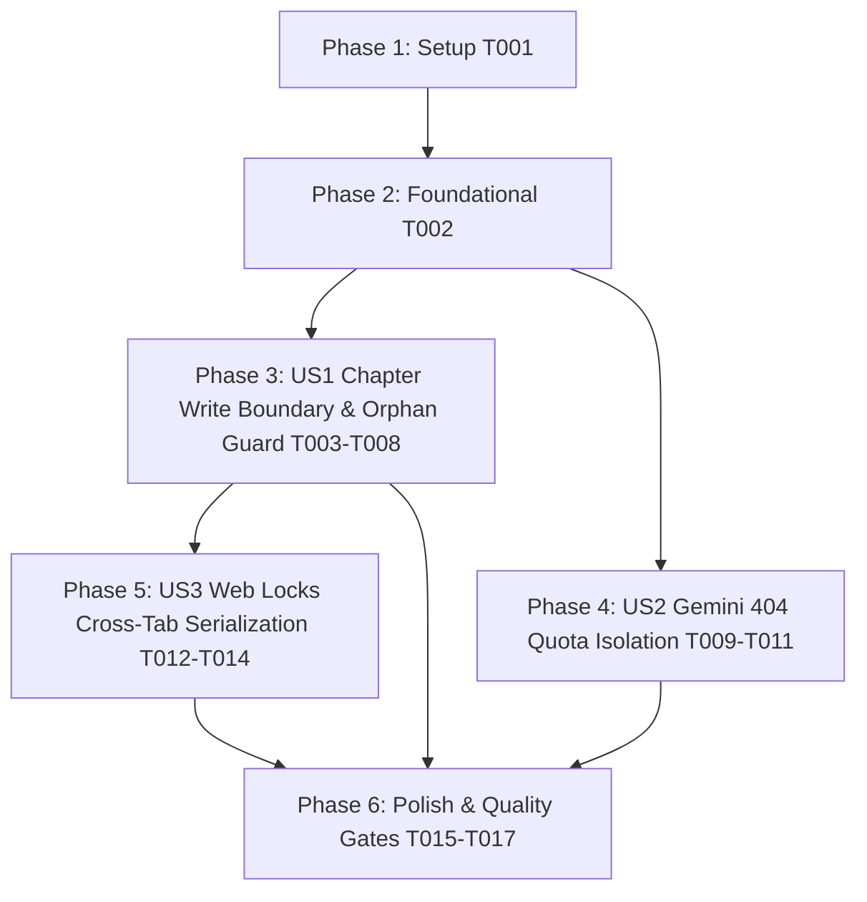

# Tasks: Project Write Boundary Serialization & Quota Error Isolation

**Feature**: `142-project-write-boundary`  
**Spec**: [`spec.md`](./spec.md) | **Plan**: [`plan.md`](./plan.md)  
**Status**: Ready for Implementation  

---

## Phase 1: Setup & Pre-Flight Checks

**Purpose**: Baseline verification of current repository state and test harness

- [x] T001 Verify baseline repo state, test suite, and lint gates via `npm run lint` and `npm test`

---

## Phase 2: Foundational (Blocking Prerequisites)

**Purpose**: Core locking abstractions in IndexedDB service layer

- [x] T002 Implement `withProjectLock<T>` Web Locks helper with fallback in `src/services/db.ts`

---

## Phase 3: User Story 1 - Comprehensive Project Write Boundary & Orphan Child Resurrection Guard (Priority: P1) 🎯 MVP

**Goal**: Extend `projectWriteChains.get(projectId)` to serialize `saveChapterToDB`, `saveChaptersToDB`, `saveCrdtState`, and `saveCrdtStates`. Enforce parent project existence checks in IndexedDB so that any write for a deleted project cleanly aborts, preventing orphan child record resurrection.  
**Independent Test**: Simulate concurrent chapter saves / CRDT writes and project deletion; verify all records belonging to the deleted project are 100% wiped and subsequent queued writes abort cleanly without creating orphan records.

### Tests for User Story 1

- [x] T003 [P] [US1] Add unit and race condition tests in `src/services/__tests__/projectDeleteQueue.test.ts` for concurrent chapter save vs project delete and post-delete write aborts

### Implementation for User Story 1

- [x] T004 [US1] Update `saveChapterToDB` in `src/services/db.ts` to serialize under `projectWriteChains.get(projectId)`, resolve missing `projectId`, and abort if parent project does not exist
- [x] T005 [US1] Update `saveChaptersToDB` in `src/services/db.ts` to group by `projectId`, serialize under `projectWriteChains`, and verify parent project existence
- [x] T006 [US1] Update `saveCrdtState` and `saveCrdtStates` in `src/services/db.ts` to serialize under `projectWriteChains.get(projectId)` and verify parent project existence
- [x] T007 [US1] Add settled promise cleanup (`.finally()`) to all chapter and CRDT write chains in `src/services/db.ts`
- [x] T008 [US1] Run and verify `src/services/__tests__/projectDeleteQueue.test.ts` passes cleanly

---

## Phase 4: User Story 2 - Gemini Non-Credential (404 Resource/Model) Quota Isolation (Priority: P2)

**Goal**: Ensure HTTP 404 (`RESOURCE_NOT_FOUND`) errors from Gemini API do NOT invoke `localQuotaTracker.recordFailure()` on API keys, leaving key health statistics (`errorsTotal`, `consecutiveErrors`, `circuitBreakerStatus`) unpenalized while maintaining immediate fail-fast behavior.  
**Independent Test**: Mock Gemini API returning HTTP 404; verify `callGemini()` throws `RESOURCE_NOT_FOUND` on attempt 1 without rotating keys and without incrementing key errors in `localQuotaTracker`.

### Tests for User Story 2

- [x] T009 [P] [US2] Add unit tests in `src/services/gemini/__tests__/geminiClient.test.ts` verifying HTTP 404 does not call `recordFailure` or increment key errors

### Implementation for User Story 2

- [x] T010 [US2] Update `executeLogicalGeminiCall` in `src/services/gemini/geminiClient.ts` to omit `recordFailure()` on HTTP 404 / `RESOURCE_NOT_FOUND` while letting `callGemini` record `recordLogicalFailure()`
- [x] T011 [US2] Run and verify `src/services/gemini/__tests__/geminiClient.test.ts` and `src/services/gemini/__tests__/geminiErrorClassifier.test.ts` pass cleanly

---

## Phase 5: User Story 3 - Cross-Tab Project Write Serialization via Web Locks API (Priority: P2)

**Goal**: Coordinate project write and delete operations across multiple browser tabs using `navigator.locks` to prevent cross-tab write collisions and last-write-wins hazards.  
**Independent Test**: Simulate concurrent multi-context writes on the same `projectId`; verify `withProjectLock` enforces mutual exclusion across contexts with graceful fallback when `navigator.locks` is unavailable.

### Tests for User Story 3

- [x] T012 [P] [US3] Add unit tests for `withProjectLock` in `src/services/__tests__/projectWriteLock.test.ts` testing both Web Locks active and fallback modes

### Implementation for User Story 3

- [x] T013 [US3] Integrate `withProjectLock` into `saveProjectToDB`, `atomicSaveProjectBundle`, `deleteProjectFromDB`, `saveChapterToDB`, `saveChaptersToDB`, `saveCrdtState`, and `saveCrdtStates` in `src/services/db.ts`
- [x] T014 [US3] Run and verify `src/services/__tests__/projectWriteLock.test.ts` passes cleanly

---

## Phase 6: Polish & Strict Quality Gates (NON-NEGOTIABLE)

**Purpose**: Execute mandatory constitution quality checks before reporting completion

- [x] T015 [P] Run `npm run lint` (`tsc --noEmit`) to verify 0 TypeScript type errors
- [x] T016 Run `npm test` (`vitest run`) to verify all unit and integration tests pass cleanly
- [x] T017 Run `npm run build` (`tsc && vite build`) to verify production bundle build succeeds

---

## Dependencies & Execution Order

---

## Parallel Execution Opportunities

- **Phase 3 (US1 Tests)**: `T003` can be written while reviewing `T002`.
- **Phase 4 (US2)**: `T009-T011` operates on `src/services/gemini/` and can run in parallel with US1 work on `src/services/db.ts`.
- **Phase 5 (US3 Tests)**: `T012` can be written independently in a new test file `projectWriteLock.test.ts`.

---

## Implementation Strategy

### MVP First (User Story 1 Only)
1. Complete Setup (`T001`) and Foundational (`T002`).
2. Implement User Story 1 (`T003-T008`): extend `projectWriteChains` to chapter & CRDT writes with parent existence check.
3. Validate: run `projectDeleteQueue.test.ts` to confirm 0 orphan chapters upon project deletion.

### Incremental Delivery
1. Foundation + US1 -> Deliver core orphan prevention MVP.
2. Add US2 (`T009-T011`) -> Deliver Gemini 404 quota isolation.
3. Add US3 (`T012-T014`) -> Deliver cross-tab Web Locks serialization.
4. Run strict quality gates (`T015-T017`) -> Verify 0 lint errors, 100% test pass, successful build.
