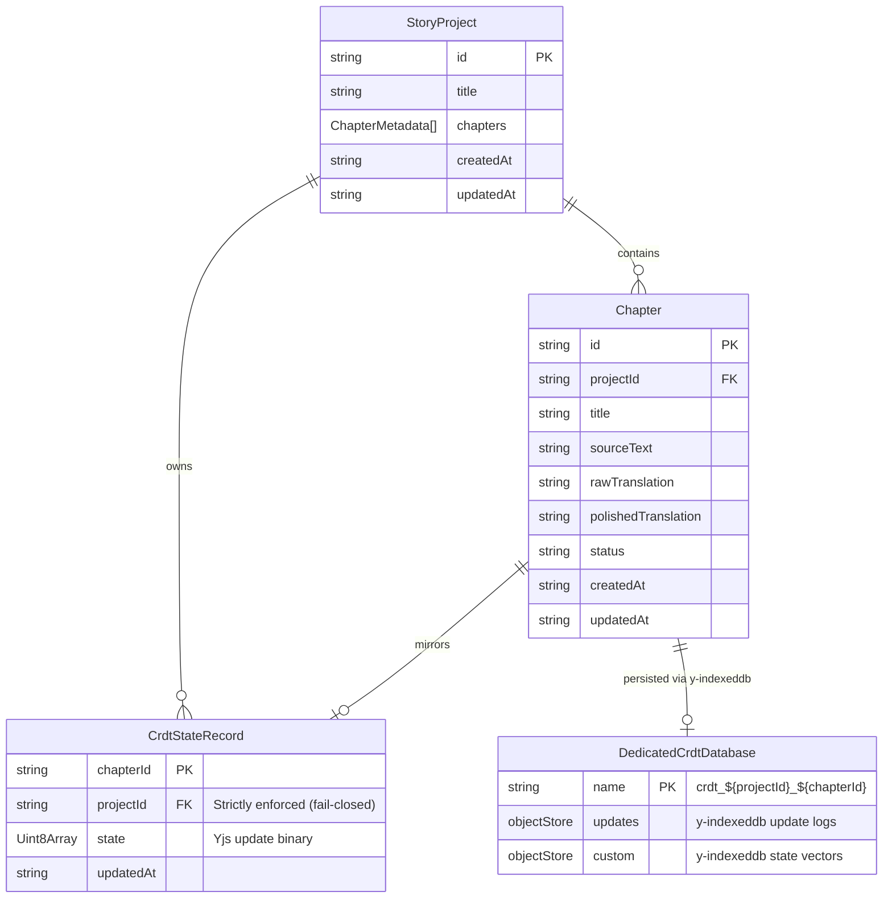

# Data Model: CRDT Lifecycle, Storage Integrity, and Lock Isolation Hardening

**Feature**: `144-crdt-lifecycle-storage-integrity`  
**Date**: 2026-09-17

---

## 1. Storage Entities and Relationships



---

## 2. In-Memory Entities

### 2.1. Active Persistence Registry (`crdtPersistenceRegistry`)

Tracks all active `IndexeddbPersistence` instances opened by editor hooks in the current tab to ensure they can be cleanly unmounted and destroyed before database deletions.

```ts
interface ActivePersistenceEntry {
  dbName: string; // "crdt_${projectId}_${chapterId}"
  projectId: string;
  chapterId: string;
  provider: {
    destroy(): Promise<void> | void;
  };
}
```

- **Lifecycle**:
  - `registerCrdtPersistence(dbName, provider)`: Called when `new IndexeddbPersistence(...)` is created in `useChapterCRDT`.
  - `unregisterCrdtPersistence(dbName, provider)`: Called when hook unmounts or chapter switches.
  - `destroyCrdtPersistence(dbName)`: Invoked before `indexedDB.deleteDatabase(dbName)` to close active connections immediately.
  - `destroyAllCrdtPersistencesForProject(projectId, knownChapterIds)`: Invoked when deleting a project to close all open chapter persistence instances.

---

### 2.2. Web Lock Outcome Entity

Discriminated union decoupling Web Lock acquisition errors from application callback errors.

```ts
export type LockOutcome<T> =
  | { ok: true; value: T }
  | { ok: false; error: unknown };
```

- **State Transition**:
  1. `withRetry` attempts `navigator.locks.request(...)`.
  2. If `navigator.locks.request` rejects (lock unavailable / AbortError), `withRetry` retries lock acquisition.
  3. Inside granted lock: `fn()` executes inside a `try...catch` block.
     - On success: returns `{ ok: true, value }`.
     - On error: returns `{ ok: false, error }`.
  4. The lock callback returns normally; the lock is released.
  5. `withRetry` sees fulfilled promise and terminates retry loop.
  6. `withProjectLock` unpacks `outcome`: if `!outcome.ok`, throws `outcome.error`.

---

## 3. Storage Validation Rules

| Entity / Function | Invariant | Violation Behavior |
| :--- | :--- | :--- |
| `saveCrdtState(record)` | `record.projectId` must be a non-empty string. | Logs a diagnostic warning and aborts without writing to `crdt_states`. |
| `saveCrdtStates(records)` | All saved records must have a non-empty `projectId`. | Filters out invalid records, logs diagnostic warnings, persists only valid records. |
| `atomicSaveProjectBundle(project, chapters, crdtStates)` | Every `item.projectId` in `crdtStates` must equal `project.id` (or be omitted). | Throws descriptive validation `Error` immediately before opening any transaction. |
| `deleteProjectCrdtDatabases(projectId, knownChapterIds)` | Only exact derived DB names (`crdt_${projectId}_${chapterId}`) are deleted. | Prefix sweeping via `startsWith` is removed to prevent cross-project deletions. |
| `deleteChapterFromDB(chapterId, projectId?)` | Deletes from `CHAPTERS_STORE`, `CRDT_STATES_STORE`, and deletes `crdt_${projectId}_${chapterId}`. | Resolves strictly on `transaction.oncomplete` and ensures dedicated CRDT DB is removed. |
| `deleteChaptersByProjectFromDB(projectId)` | Transaction deletion cursor. | Resolves strictly on `transaction.oncomplete`. |
| `handleDeleteProject(projectId)` Undo | Restores project metadata, chapters, and `crdt_states`. | Backs up `crdt_states` prior to deletion; restores all three on Undo. |
