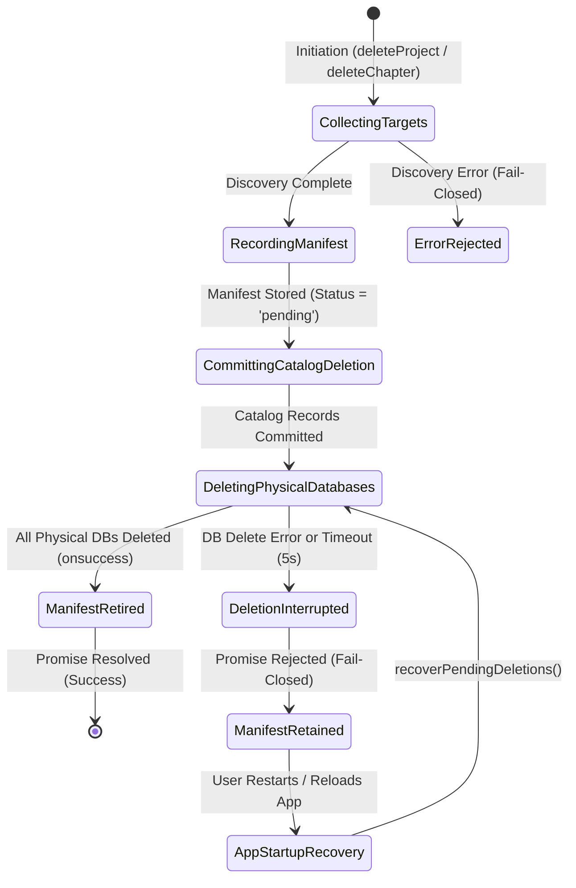

# Data Model: CRDT Storage Lifecycle Recovery and Invariant Hardening

## 1. New Entities

### DeletionManifestRecord
Represents a durable tombstone / manifest capturing the exact identities of dedicated physical browser storage instances targeted for deletion before catalog records are removed.

```typescript
export interface DeletionManifestRecord {
  /**
   * Unique manifest identifier.
   * Format: "proj_${projectId}" for project deletion, or "chap_${chapterId}" for chapter deletion.
   */
  id: string;

  /**
   * Target parent project identifier.
   */
  projectId: string;

  /**
   * Exhaustive list of chapter IDs associated with this deletion.
   */
  chapterIds: string[];

  /**
   * Exact physical database names to delete via indexedDB.deleteDatabase.
   * Format: "crdt_${projectId}_${chapterId}"
   */
  physicalDbNames: string[];

  /**
   * ISO 8601 creation timestamp.
   */
  createdAt: string;

  /**
   * Current lifecycle status.
   * - 'pending': Manifest registered, physical cleanup pending or in progress.
   * - 'completed': Physical cleanup finished (ready for removal).
   */
  status: 'pending' | 'completed';
}
```

### IndexedDB Schema Upgrade: Version 5
- **Store Name**: `deletion_manifests` (`export const DELETION_MANIFESTS_STORE = 'deletion_manifests'`)
- **Key Path**: `id`
- **Indexes**:
  - `status`: `{ unique: false }`
  - `projectId`: `{ unique: false }`

---

## 2. Updated Entity Validation Rules

### Chapter Entity Invariants
- **Immutability of `projectId`**:
  - When saving a chapter via `saveChapterToDB(chapter)` or `saveChaptersToDB(chapters)`:
  - If `existing = chaptersStore.get(chapter.id)` exists and `existing.projectId` is defined:
    - If `existing.projectId !== chapter.projectId`:
      - Action: **Abort transaction** and **Reject promise** with `Error("Relational integrity violation: Cannot re-parent chapter...")`.
      - Silent write drops are strictly forbidden.

### CRDT State Record Invariants
- **Mandatory Parent Project**: `record.projectId` must be a non-empty string.
- **Mandatory Chapter Existence**:
  - `chapter = chaptersStore.get(record.chapterId)` must return an existing record.
  - If `!chapter`: **Abort transaction** and **Reject promise** with `Error("Relational integrity violation: Chapter does not exist...")`.
- **Project Association**:
  - `chapter.projectId` must equal `record.projectId`.
  - If `chapter.projectId !== record.projectId`: **Abort transaction** and **Reject promise** with `Error("Relational integrity violation: Chapter belongs to different project...")`.

### Chapter Deletion Invariants
- **Canonical `projectId` Resolution**:
  - If caller passes `deleteChapterFromDB(chapterId, suppliedProjectId)`:
    - If stored chapter exists and `suppliedProjectId && suppliedProjectId !== storedChapter.projectId`:
      - Action: **Reject promise** with `Error("Mismatched projectId for chapter...")`.
    - If `!suppliedProjectId`: resolve `canonicalProjectId = storedChapter.projectId`.

---

## 3. Lifecycle State Machine: Deletion & Recovery


