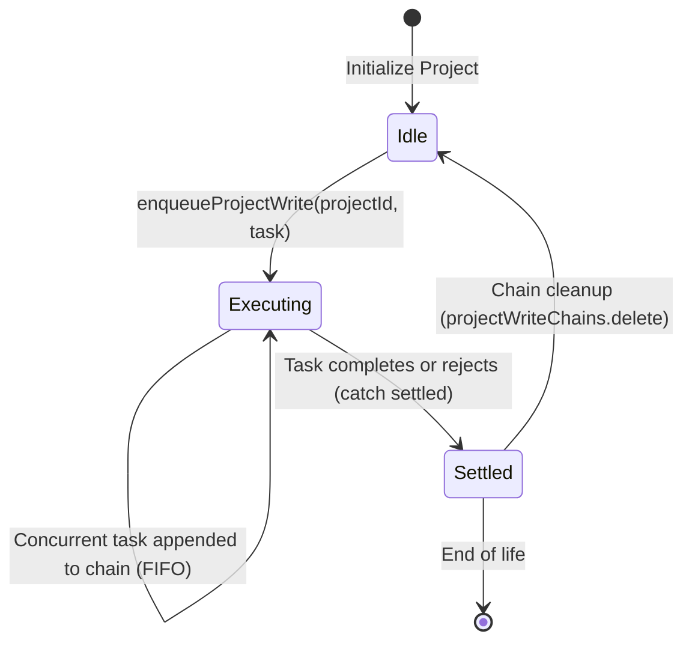

# Data Model & State Invariants: Post-Audit Integrity & Quality Hardening

**Feature Branch**: `150-post-audit-hardening`  
**Date**: 2026-09-20  
**Status**: Completed  
**Spec Reference**: [spec.md](spec.md) | **Research**: [research.md](research.md)

---

## 1. Entities & Data Schemas

### 1.1 Public Origin Configuration Entity

Represents the deployment origin parameters resolved at build-time and execution-time.

```typescript
export interface PublicOriginConfig {
  /**
   * Fully qualified public origin without trailing slash (e.g., "https://api-dich-truyen.onrender.com")
   * Resolved in priority: loadEnv(mode).VITE_PUBLIC_URL -> process.env.VITE_PUBLIC_URL -> default fallback
   */
  publicUrl: string;

  /**
   * Base router path for subfolder deployments (e.g., "/" or "/dichtruyen/")
   */
  baseUrl: string;

  /**
   * Target deployment mode ("development" | "production" | string)
   */
  mode: string;
}
```

**Validation Invariants**:
- `publicUrl` MUST start with a valid web protocol (`https://` or `http://`).
- `publicUrl` MUST NOT end with a trailing slash (`/`).
- If `VITE_PUBLIC_URL` is empty or undefined, defaults to `'https://api-dich-truyen.onrender.com'`.

---

### 1.2 Sitemap Document Structure

Represents the search engine index format serialized to `/dist/sitemap.xml`.

```typescript
export interface SitemapUrlEntry {
  loc: string;         // Fully qualified canonical URL incorporating PublicOriginConfig.publicUrl
  lastmod: string;     // ISO 8601 Date string (YYYY-MM-DD)
  changefreq: 'always' | 'hourly' | 'daily' | 'weekly' | 'monthly' | 'yearly' | 'never';
  priority: number;    // Floating point number between 0.0 and 1.0
}
```

**Validation Invariants**:
- Every `<loc>` entry in `sitemap.xml` MUST be prefixed with `PublicOriginConfig.publicUrl`.
- No `<loc>` entry may contain hard-coded external domains unless explicitly configured as the `publicUrl`.

---

### 1.3 EPUB Package Descriptor & Archive Schema

Represents the physical archive hierarchy conforming to the IDPF EPUB 3.0 specification.

```typescript
export interface EpubMimetypeRecord {
  fileName: 'mimetype';
  content: 'application/epub+zip';
  compression: 'STORE';  // Must NOT be compressed (deflate prohibited)
  entryIndex: 0;         // Must be the first physical file in the zip directory
}

export interface EpubXmlDocumentDescriptor {
  path: string;          // e.g. "OEBPS/content.opf", "META-INF/container.xml"
  mediaType: string;     // e.g. "application/oebps-package+xml", "application/xhtml+xml"
  content: string;       // XML / XHTML markup string
  isWellFormed: boolean; // Verified via XML parser (zero parsererror elements)
}
```

**Validation Invariants**:
- `mimetype` MUST be the first key in the archive entry collection.
- `mimetype` compression option MUST be explicitly set to `'STORE'`.
- All XML and XHTML descriptors MUST pass XML well-formedness parsing with 0 syntax errors.
- Download blob URL lifetime: `URL.createObjectURL(blob)` MUST remain active until download invocation completes, with revocation deferred via timeout (`delay >= 500ms`).

---

### 1.4 Database Write Queue Invariant

Represents the in-memory Promise chain sequencing mutations per `projectId`.

```typescript
export interface ProjectWriteQueueChain {
  projectId: string;
  chain: Promise<void>;
  status: 'idle' | 'executing' | 'settled';
}
```

**State Transitions**:


**Validation Invariants**:
- Operations targeting the same `projectId` execute strictly in FIFO order.
- A failed operation in the chain settles with error rejection for the caller, but the chain itself catches the rejection to prevent blocking subsequent queued operations.
- Interleaved sequence `save A1 -> save A2 -> delete A -> save A3` guarantees that `delete A` completes before `save A3` begins, and the final state is `save A3`.

---

### 1.5 Bundle Input Validation Schema

Represents the separation of in-memory structural validation from in-transaction database checks in `executeAtomicSaveProjectBundle`.

```typescript
export interface BundleInputValidationSchema {
  project: StoryProject;
  chapters: Chapter[];
  crdtStates?: (CrdtBinaryStateItem | CrdtStateRecord)[];
}
```

**Validation Rules**:
1. `validateBundleInput(project, chapters, crdtStates)` (In-Memory Pre-Check):
   - Every `crdtState.chapterId` must exist in `chapters.map(c => c.id)`. Throws `"Orphan CRDT state"` if not.
   - Every `crdtState` must belong to a chapter whose `projectId === project.id`. Throws `"Mismatched projectId in CRDT state"` if not.
2. `assertChapterOwnership(existing, incomingProjectId, chapterId)` (In-Transaction Relational Guard):
   - If an existing record exists in `CHAPTERS_STORE`, its `projectId` MUST equal `incomingProjectId`.
   - Throws `"Relational integrity violation: chapter ... belongs to project ..."` on mismatch.
