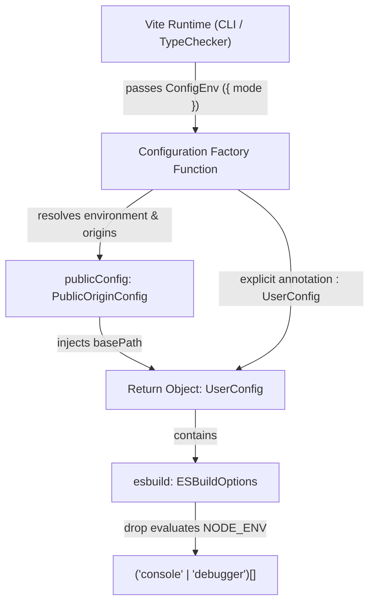

# Data Model & Type Contract: Vite Build & Esbuild Configuration

**Branch**: `153-vite-esbuild-type-fix`  
**Date**: 2026-09-21  

---

## 1. Core Configuration Entities

### 1.1 `ConfigEnvContext`
Context object supplied by Vite runtime to the configuration factory function:
- **`mode`** (`string`, mandatory): Current execution mode, such as `'development'`, `'production'`, or `'test'`.
- **`command`** (`'build' | 'serve'`, optional): The primary command being executed.
- **`isSsrBuild`** (`boolean`, optional): Flag denoting server-side rendering bundle generation (always false/undefined for client-side SPA).
- **`isPreview`** (`boolean`, optional): Denotes preview server startup.

### 1.2 `ViteUserConfig`
Top-level configuration object adhering to Vite's `UserConfig` interface:
- **`base`** (`string`, mandatory): Base public URL path resolved via `publicConfig.basePath` (e.g., `'/'` or `'/subpath/'`).
- **`plugins`** (`PluginOption[]`, mandatory): Array of Vite and Rollup plugins, including:
  - `@vitejs/plugin-react` (`PluginOption`)
  - `@tailwindcss/vite` (`PluginOption`)
  - `html-transform-public-url` (inline Vite plugin for HTML metadata injection)
  - `sitemap-transform-public-url` (inline Vite plugin for XML sitemap post-processing)
- **`resolve`** (`ResolveOptions`, mandatory): Module path aliases:
  - `alias`: Record mapping `'@'` to project root path.
- **`esbuild`** (`ESBuildOptions | false`, mandatory): TypeScript / JSX compiler transform configuration.
- **`build`** (`BuildOptions`, mandatory): Rollup bundling options:
  - `outDir`: Target output directory (`'dist'`).
  - `emptyOutDir`: Boolean (`true`).
  - `sourcemap`: Boolean (`false`).
  - `chunkSizeWarningLimit`: Number (`1200`).
  - `rollupOptions.output.manualChunks`: Function partitioning vendor chunks (`vendor-react`, `vendor-db`, `vendor-dict`, `vendor-ai`, `vendor-motion`, `vendor-icons`).
- **`server`** (`ServerOptions`, mandatory): Development server configuration (host, port, security headers).
- **`preview`** (`PreviewOptions`, mandatory): Production preview server configuration (host, port, security headers).

### 1.3 `ESBuildConfig` (`ESBuildOptions`)
Transform options passed to esbuild:
- **`drop`** (`('console' | 'debugger')[]`, mandatory in this configuration): Identifies statements to be removed during compilation:
  - Production (`NODE_ENV === 'production'`): `['console', 'debugger']`.
  - Non-production: `[]`.
- **`minify`** (`never`, optional): Strictly unassigned in `ESBuildOptions` (minification is handled at the `build.minify` level).

---

## 2. Entity Relationships & Data Flow

---

## 3. Validation Rules & Constraints

1. **Explicit Return Type Annotation (FR-001)**: The configuration factory function MUST have an explicit `: UserConfig` return type annotation.
2. **Type Overload Match (FR-002, SC-002)**: The function MUST resolve directly to `UserConfigFnObject = (env: ConfigEnv) => UserConfig` without triggering overload fallback errors (`TS2769`).
3. **Union Satisfaction (FR-003)**: The `esbuild` object MUST strictly conform to `false | ESBuildOptions | undefined`. An explicit cast `as ESBuildOptions` is applied to guarantee compiler compatibility across platforms.
4. **Production Stripping Integrity (FR-004)**: When `NODE_ENV === 'production'`, `drop` MUST evaluate to `['console', 'debugger']`.
5. **Development Logging Integrity (FR-005)**: When `NODE_ENV !== 'production'`, `drop` MUST evaluate to `[]`.
