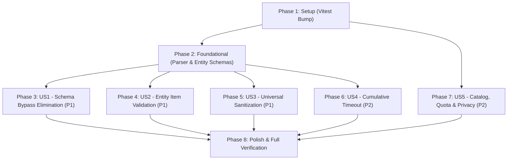

# Tasks: AI Pipeline Deep Hardening and Structural Resilience

**Feature Branch**: `156-ai-pipeline-deep-hardening` | **Date**: 2026-09-22 | **Spec**: [spec.md](spec.md) | **Plan**: [plan.md](plan.md)

## Phase 1: Setup (Shared Infrastructure)

**Purpose**: Dependency updates and project setup

- [X] T001 Update `vitest` dependency to `^4.1.11` in `package.json`
- [X] T002 Verify installed dependencies and lockfile consistency in `package-lock.json`

---

## Phase 2: Foundational (Blocking Prerequisites)

**Purpose**: Core parser utilities, entity schemas, and tightened validators required by all user stories

**⚠️ CRITICAL**: Foundational tasks must complete before user story implementation begins

- [X] T003 Define `DiscoveredEntity` and `StructuredParseResult<T>` interfaces in `src/services/translation/types.ts` and `src/lib/text.ts`
- [X] T004 [P] Implement `parseGeminiStructuredResponseWithState` with tri-state outcome (`VALID`, `PARSE_FAILED`, `SCHEMA_INVALID`) in `src/lib/text.ts`
- [X] T005 [P] Tighten `isRawTranslationResponse` and `isPolishTranslationResponse` to require at least one known translation key with non-empty string in `src/lib/text.ts`
- [X] T006 [P] Implement `validateDiscoveredEntity` item-level validator with safe string defaults and type normalization in `src/lib/text.ts`
- [X] T007 Add unit tests for `parseGeminiStructuredResponseWithState`, tightened translation guards, and `validateDiscoveredEntity` in `src/lib/__tests__/text.test.ts`

**Checkpoint**: Core parser and entity validation primitives verified and passing unit tests.

---

## Phase 3: User Story 1 - Resilient Structured Output & Schema Bypass Elimination (Priority: P1) 🎯 MVP

**Goal**: Prevent schema-invalid JSON payloads from falling back to raw JSON text in raw and polish translation services.

**Independent Test**: Supply mocked AI responses with valid JSON lacking translation keys to `translateRawDirect` and `polishTranslationDirect`; verify both services throw structural errors and never output raw JSON text as chapter translations.

### Tests for User Story 1

- [X] T008 [P] [US1] Add unit tests for structured fallback behavior and schema-invalid JSON rejection in `src/services/translation/__tests__/structuredFallback.test.ts`

### Implementation for User Story 1

- [X] T009 [US1] Refactor `translateRawDirect` to use `parseGeminiStructuredResponseWithState`, throwing on `SCHEMA_INVALID` and restricting plain-text fallback strictly to `state === 'PARSE_FAILED'` in `src/services/translation/rawTranslation.ts`
- [X] T010 [US1] Refactor `polishTranslationDirect` to use `parseGeminiStructuredResponseWithState`, throwing on `SCHEMA_INVALID` and restricting plain-text fallback strictly to `state === 'PARSE_FAILED'` in `src/services/translation/polishTranslation.ts`

**Checkpoint**: User Story 1 complete — schema-invalid JSON is rejected with explicit structural errors and cannot leak into chapter translations.

---

## Phase 4: User Story 2 - Comprehensive Discovered Entity Validation & Crash Prevention (Priority: P1)

**Goal**: Validate each extracted entity individually, eliminate `any[]` from translation results, and prevent `.trim()` crashes in workspace state.

**Independent Test**: Inject mocked translation responses with incomplete entity fields (missing `pinyin`, `vietnamese`, `note`, or non-string values); verify `useWorkspaceState.ts` and batch translation process entities smoothly with zero runtime exceptions.

### Implementation for User Story 2

- [X] T011 [P] [US2] Update `DirectRawTranslationResult` and `DirectPolishTranslationResult` to type `discoveredEntities` as `DiscoveredEntity[]` in `src/services/translation/types.ts`
- [X] T012 [US2] Integrate `validateDiscoveredEntity` item-level filtering and normalization after entity snap-back in `src/services/translation/rawTranslation.ts`
- [X] T013 [US2] Integrate `validateDiscoveredEntity` item-level filtering and normalization after entity snap-back in `src/services/translation/polishTranslation.ts`
- [X] T014 [P] [US2] Add defensive field fallbacks and `needsReview` routing before calling `.trim()` in `src/hooks/useWorkspaceState.ts`
- [X] T015 [P] [US2] Add defensive field fallbacks and type safety in `src/services/chapterTranslationService.ts`
- [X] T016 [P] [US2] Add unit tests for entity crash resilience and missing-field normalization in `src/hooks/__tests__/useWorkspaceState.test.ts`

**Checkpoint**: User Story 2 complete — all discovered entities are strongly typed, validated, and normalized before reaching workspace controllers.

---

## Phase 5: User Story 3 - Universal Manuscript Context & Instruction Sanitization (Priority: P1)

**Goal**: Ensure all user-configurable parameters (`genre`, `tone`, `description`, `additionalInstructions`, glossary items, and raw text blocks) pass through `sanitizePromptInput` before entering AI prompts.

**Independent Test**: Configure project metadata, custom instructions, and dictionary items containing zero-width characters, directional overrides, and Unicode tags; verify assembled prompts sent to the AI provider are sanitized and free of non-printable characters.

### Tests for User Story 3

- [X] T017 [P] [US3] Add unit tests verifying prompt sanitization across all metadata and instruction fields in `src/services/ai/__tests__/prompts.test.ts`

### Implementation for User Story 3

- [X] T018 [US3] Sanitize `genre`, `tone`, `description`, raw `text` block interpolation, and glossary item fields in `buildRawTranslationPayload` in `src/services/ai/prompts.ts`
- [X] T019 [US3] Sanitize `genre`, `tone`, `description`, `additionalInstructions`, and glossary item fields in `buildPolishTranslationPayload` in `src/services/ai/prompts.ts`
- [X] T020 [US3] Sanitize `genre`, `tone`, `description`, and glossary item fields in `buildQaCritiquePayload` in `src/services/ai/prompts.ts`
- [X] T021 [P] [US3] Sanitize `genre` and `tone` parameters in `rewriteSentenceDirect` in `src/services/translation/sentenceRewrite.ts`

**Checkpoint**: User Story 3 complete — 100% of user-provided metadata, custom instructions, and dictionary terms are sanitized against prompt injection and hidden control codes.

---

## Phase 6: User Story 4 - Cumulative Request Timeout Across Key Rotations (Priority: P2)

**Goal**: Enforce an overall request deadline (default 60s) across all key rotation attempts, passing decreasing remaining budgets to each attempt.

**Independent Test**: Simulate multi-key rotation with stalling network connections; verify the entire request terminates when the cumulative deadline expires and individual attempts pass decreasing remaining budgets.

### Tests for User Story 4

- [X] T022 [P] [US4] Add unit tests for cumulative request deadline tracking and timeout propagation in `src/services/gemini/__tests__/geminiClient.test.ts`

### Implementation for User Story 4

- [X] T023 [US4] Implement cumulative deadline tracking (`overallDeadlineMs`, `remainingMs` computation, passing `attemptTimeoutMs = Math.max(remainingMs, 5000)` to `executeGeminiFetch`, fail-fast on expiry) in `src/services/gemini/geminiClient.ts`

**Checkpoint**: User Story 4 complete — multi-key translation requests are bounded by a cumulative request deadline and cannot stall queues indefinitely.

---

## Phase 7: User Story 5 - Model Catalog Freshness, Quota Clarity & Security Hygiene (Priority: P2)

**Goal**: Update preset model labels, timestamps, quota documentation/UI terminology, and privacy policy release date.

**Independent Test**: Verify model labels, verification timestamps, and quota terminology in `src/config/models.ts`, `docs/model-system.md`, and `docs/privacy-policy.md`.

### Implementation for User Story 5

- [X] T024 [P] [US5] Update preset model definitions with label `Gemini 2.5 Pro (Preset cao cấp)`, timestamps `2026-09-22`, and local scheduler quota comments in `src/config/models.ts`
- [X] T025 [P] [US5] Update quota terminology to "Local scheduler defaults" and clarify project-level Google quota behavior in `docs/model-system.md`
- [X] T026 [P] [US5] Replace release date placeholder with official publication date `22/09/2026` in `docs/privacy-policy.md`
- [X] T027 [P] [US5] Update quota explanatory copy regarding multiple keys in the same project in `src/components/api-settings/KeyListSection.tsx`

**Checkpoint**: User Story 5 complete — model catalog, documentation, UI copy, and privacy policy are accurate, clear, and synchronized.

---

## Phase 8: Polish & Cross-Cutting Concerns

**Purpose**: Comprehensive verification across all feature components

- [X] T028 [P] Run dependency audit to verify resolution of Vitest advisory GHSA-82fw-gwwq-j7x9 via `npm audit`
- [X] T029 Verify TypeScript compilation with zero type errors via `npm run lint`
- [X] T030 Run full automated test suite with 100% pass status via `npm test`
- [X] T031 Verify production bundle buildability via `npm run build`
- [X] T032 Validate end-to-end verification scenarios per `specs/156-ai-pipeline-deep-hardening/quickstart.md`

---

## Dependencies & Execution Order

### Phase Dependencies

- **Setup (Phase 1)**: No dependencies — can start immediately.
- **Foundational (Phase 2)**: Depends on Phase 1 — BLOCKS all user stories.
- **User Story 1 (Phase 3)**: Depends on Phase 2 (tri-state parser `parseGeminiStructuredResponseWithState`).
- **User Story 2 (Phase 4)**: Depends on Phase 2 (`DiscoveredEntity` schema and `validateDiscoveredEntity`).
- **User Story 3 (Phase 5)**: Depends on Phase 2 — can run in parallel with US1 and US2.
- **User Story 4 (Phase 6)**: Depends on Phase 1 — can run in parallel with US1, US2, US3.
- **User Story 5 (Phase 7)**: Depends on Phase 1 — documentation and config updates, can run in parallel.
- **Polish (Phase 8)**: Depends on completion of all user story phases.

### User Story Dependencies



### Parallel Opportunities

- **Phase 2**: T004, T005, T006 can be developed in parallel (distinct sections of `src/lib/text.ts`).
- **Phase 3**: T008 (test) can be written first; T009 and T010 modify separate files (`rawTranslation.ts` vs `polishTranslation.ts`).
- **Phase 4**: T011, T014, T015 can run in parallel (types, hook, batch service).
- **Phase 5**: T017, T021 can run in parallel with prompt updates.
- **Phase 7**: T024, T025, T026, T027 modify distinct files (`models.ts`, `model-system.md`, `privacy-policy.md`, `KeyListSection.tsx`).

---

## Parallel Example: User Story 1 & User Story 2

```bash
# User Story 1 Implementation (Raw & Polish Translation):
Task T009: "Refactor translateRawDirect in src/services/translation/rawTranslation.ts"
Task T010: "Refactor polishTranslationDirect in src/services/translation/polishTranslation.ts"

# User Story 2 Implementation (Hooks & Batch Service):
Task T014: "Add defensive field fallbacks in src/hooks/useWorkspaceState.ts"
Task T015: "Add defensive field fallbacks in src/services/chapterTranslationService.ts"
```

---

## Implementation Strategy

### MVP First (User Story 1 Only)

1. Complete Phase 1: Setup (`vitest` bump).
2. Complete Phase 2: Foundational (parser tri-state, tightened guards, entity validator).
3. Complete Phase 3: User Story 1 (bypass elimination in raw & polish services).
4. **VALIDATE**: Run `npm test -- --run src/services/translation/__tests__/structuredFallback.test.ts`.
5. At this point, the primary P1 security/correctness vulnerability is resolved.

### Incremental Delivery

1. Phase 1 + Phase 2 → Primitives ready.
2. Phase 3 (US1) → Schema-invalid JSON bypass blocked (MVP).
3. Phase 4 (US2) → Discovered entities strongly typed and crash-proof.
4. Phase 5 (US3) → Full prompt sanitization across all metadata and instructions.
5. Phase 6 (US4) → Cumulative 60s request deadline prevents queue hangs.
6. Phase 7 (US5) → Catalog, quota docs, and privacy policy aligned.
7. Phase 8 → Full quality gates pass clean (`npm run lint`, `npm test`, `npm run build`).
