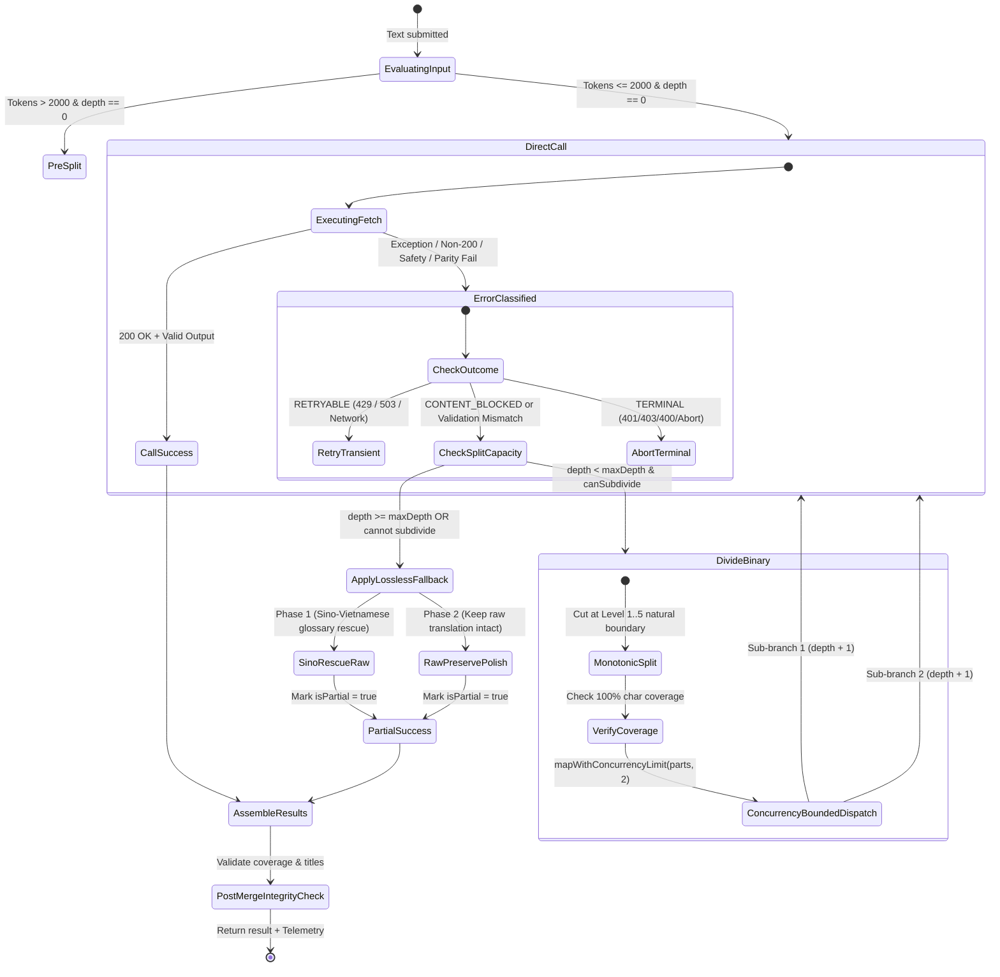

# Data Model & State Transitions: Translation Resilience Upgrade

**Feature**: [Translation Resilience Upgrade (Spec 162)](./spec.md)  
**Branch**: `162-translation-resilience-upgrade`  
**Date**: 2026-09-26  

---

## 1. Core Entities & Types

### 1.1. Translation Outcome Classification
```typescript
/**
 * Phân loại kết quả dịch thuật và trạng thái nhánh đệ quy
 */
export type TranslationOutcomeType = 
  | 'SUCCESS'     // Dịch thành công 100% bằng AI
  | 'PARTIAL'     // Hoàn thành với ít nhất một nhánh áp dụng cứu nguy lossless
  | 'RETRYABLE'   // Lỗi tạm thời (Network, 503 Overload, 429 Rate Limit)
  | 'TERMINAL';   // Lỗi không thể hồi phục (401/403 Auth, 400 Bad Request, hoặc CONTENT_BLOCKED ở lá)

export interface ClassifiedTranslationOutcome {
  outcome: TranslationOutcomeType;
  reason: string;
  isRetryable: boolean;
  canSubdivide: boolean;
  httpStatus?: number;
  originalError?: unknown;
}
```

### 1.2. Monotonic Partition Model
```typescript
/**
 * Phân vùng văn bản đơn điệu không mất mát
 */
export interface MonotonicTextPartition {
  index: number;
  totalPartitions: number;
  text: string;
  charStart: number;
  charEnd: number;
  estimatedTokens: number;
}

/**
 * Báo cáo kiểm định tính bao phủ của văn bản nguồn
 */
export interface SourceCoverageReport {
  isComplete: boolean;
  originalLength: number;
  concatenatedLength: number;
  isExactMatch: boolean;
  droppedCharsCount: number;
  missingSpans: Array<{ start: number; end: number }>;
}
```

### 1.3. Telemetry & Execution Metrics
```typescript
/**
 * Thống kê thực thi và phân nhánh đệ quy
 */
export interface SplitBranchTelemetry {
  totalSplits: number;
  retriedBranches: number;
  fallbackBranches: number;
  failedBranchKeys: string[];
  executionDurationMs: number;
  outcome: 'SUCCESS' | 'PARTIAL';
  branches: Array<{
    depth: number;
    charRange: { start: number; end: number };
    outcome: TranslationOutcomeType;
    reason?: string;
    tier: 'ai' | 'sino-fallback' | 'raw-fallback';
  }>;
}
```

### 1.4. Permissive Safety Settings Schema
```typescript
export enum HarmCategory {
  HARM_CATEGORY_HARASSMENT = 'HARM_CATEGORY_HARASSMENT',
  HARM_CATEGORY_HATE_SPEECH = 'HARM_CATEGORY_HATE_SPEECH',
  HARM_CATEGORY_SEXUALLY_EXPLICIT = 'HARM_CATEGORY_SEXUALLY_EXPLICIT',
  HARM_CATEGORY_DANGEROUS_CONTENT = 'HARM_CATEGORY_DANGEROUS_CONTENT',
}

export enum HarmBlockThreshold {
  BLOCK_NONE = 'BLOCK_NONE',
  BLOCK_LOW_AND_ABOVE = 'BLOCK_LOW_AND_ABOVE',
  BLOCK_MEDIUM_AND_ABOVE = 'BLOCK_MEDIUM_AND_ABOVE',
  BLOCK_ONLY_HIGH = 'BLOCK_ONLY_HIGH',
}

export interface GeminiSafetySetting {
  category: HarmCategory | string;
  threshold: HarmBlockThreshold | string;
}
```

---

## 2. State Transition Diagrams

### 2.1. Recursive Split & Leaf Fallback Lifecycle



---

## 3. Invariants & Validation Rules

| Quy tắc Bất biến (Invariant) | Mô tả xác thực | Hành động khi vi phạm |
| :--- | :--- | :--- |
| **INV-001 (100% Source Coverage)** | $\sum_{i=0}^{k-1} \text{chunk}_i \equiv S$ (Ghép nối chính xác từng ký tự gốc). | Dừng chia đoạn, chuyển sang xử lý nguyên khối hoặc fallback an toàn. |
| **INV-002 (Non-Overlapping Cut Points)** | $0 = c_0 < c_1 < \dots < c_k = |S|$. | Chuẩn hóa mảng chỉ số cắt, loại bỏ phần tử trùng/nghịch đảo. |
| **INV-003 (Protected Span Integrity)** | Điểm cắt $c_i \notin [start_{\text{bracket}}, end_{\text{bracket}}]$. | Lùi $c_i$ về trước $start_{\text{bracket}}$. |
| **INV-004 (Zero Key Burning on Content Block)** | Lỗi `CONTENT_BLOCKED` không bao giờ gọi `localQuotaTracker.recordRetry()` hoặc chuyển `startKeyIndex`. | Giữ nguyên khóa hiện tại, ném `GeminiRequestError(CONTENT_BLOCKED)`. |
| **INV-005 (Bounded Concurrency)** | Số cuộc gọi fetch đồng thời qua `mapWithConcurrencyLimit` $\le 2$. | Hàng đợi tự động chờ cuộc gọi trước hoàn thành. |
| **INV-006 (Cooperative Abort)** | Khi `signal.aborted === true`, không gửi thêm bất kỳ request nào. | Ném `AbortError` lập tức. |
| **INV-007 (Cumulative Deadline)** | Thời gian thực thi toàn cây $\le \text{cumulativeTimeoutMs}$. | Tự động áp dụng cứu nguy cho nhánh chưa gọi. |
