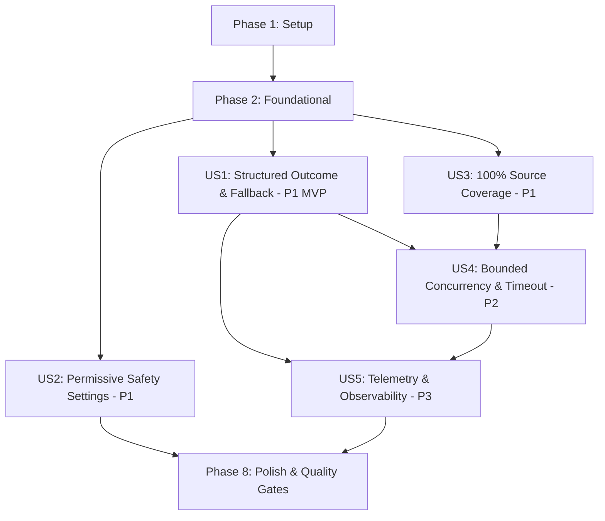

# Tasks: Translation Resilience Upgrade (Spec 162)

**Branch**: `162-translation-resilience-upgrade` | **Date**: 2026-09-26 | **Spec**: [specs/162-translation-resilience-upgrade/spec.md](./spec.md) | **Plan**: [specs/162-translation-resilience-upgrade/plan.md](./plan.md)

---

## Phase 1: Setup (Shared Infrastructure)

**Purpose**: Định nghĩa các kiểu dữ liệu cốt lõi cho an toàn Gemini, phân loại kết quả dịch thuật, tính toán phân vùng và telemetry.

- [X] T001 [P] Khởi tạo các enum và interface an toàn Gemini (`HarmCategory`, `HarmBlockThreshold`, `GeminiSafetySetting`) trong `src/services/gemini/types.ts`
- [X] T002 [P] Khởi tạo các kiểu dữ liệu resilience (`TranslationOutcomeType`, `SplitBranchTelemetry`, `MonotonicTextPartition`, `SourceCoverageReport`) và mở rộng params/results trong `src/services/translation/types.ts`

---

## Phase 2: Foundational (Blocking Prerequisites)

**Purpose**: Xây dựng hạ tầng phân loại lỗi và cấu hình an toàn chặn trước — bắt buộc hoàn thành trước khi triển khai bất kỳ User Story nào.

- [X] T003 [P] Cập nhật hàm cấu hình an toàn cho phép tối đa `getPermissiveSafetySettings()` và tích hợp vào `buildPayload()` trong `src/services/gemini/geminiRequestBuilder.ts`
- [X] T004 [P] Xây dựng bộ phân loại kết quả dịch thuật có cấu trúc `classifyTranslationOutcome()` thay thế việc dò tìm chuỗi tự do trong `src/services/translation/translationValidation.ts`

**Checkpoint**: Nền tảng phân loại lỗi và payload an toàn sẵn sàng — việc triển khai các User Stories có thể bắt đầu.

---

## Phase 3: User Story 1 - Phân đoạn thích ứng và phục hồi cục bộ khi gặp lỗi nội dung (Priority: P1) 🎯 MVP

**Goal**: Cách ly vị trí lỗi nội dung (`CONTENT_BLOCKED`), không xoay vòng API key trên cùng prompt, chỉ tái thử trên nhánh con bị lỗi và áp dụng cứu nguy Hán-Việt/raw không mất mát dữ liệu kèm nhãn `isPartial: true`.

**Independent Test**: Cung cấp một khối văn bản có 1 đoạn kích hoạt `CONTENT_BLOCKED`; xác minh nhánh lỗi không xoay API key, nhánh còn lại dịch thành công qua AI, nhánh lỗi được cứu nguy Hán-Việt và kết quả cuối cùng ghép nối đầy đủ kèm `isPartial: true`.

### Tests for User Story 1 🧪

- [X] T005 [P] [US1] Unit test kiểm tra phân loại kết quả `classifyTranslationOutcome` (SUCCESS, RETRYABLE, TERMINAL, PARTIAL) với `GeminiRequestError` trong `src/services/translation/__tests__/translationValidation.test.ts`
- [X] T006 [P] [US1] Integration test kiểm tra hành vi không xoay vòng key khi `CONTENT_BLOCKED` và cứu nguy cục bộ độc lập nhánh trong `src/services/__tests__/directTranslationEngine.test.ts`

### Implementation for User Story 1

- [X] T007 [US1] Tích hợp `classifyTranslationOutcome()` vào luồng bắt lỗi của `rawWithContentSplitDirect()` trong `src/services/translation/rawTranslation.ts`
- [X] T008 [US1] Triển khai chặn xoay vòng API key và cấm retry cùng prompt khi nhận kết quả `CONTENT_BLOCKED` trong `src/services/translation/rawTranslation.ts`
- [X] T009 [US1] Tái cấu trúc cơ chế đệ quy chỉ chạy trên nhánh con bị lỗi (`fault-branch only`), bảo toàn kết quả các nhánh anh em đã thành công trong `src/services/translation/rawTranslation.ts`
- [X] T010 [US1] Triển khai cứu nguy Hán-Việt tất định kèm gắn cờ `isPartial: true` cho nhánh lá cạn độ sâu trong `src/services/translation/rawTranslation.ts`
- [X] T011 [US1] Đồng bộ cơ chế xử lý lỗi có cấu trúc, bảo tồn `rawTranslation` và gắn `isPartial: true` cho Phase 2 trong `src/services/translation/polishTranslation.ts`

**Checkpoint**: User Story 1 hoàn thành — hệ thống có khả năng chịu lỗi nội dung cục bộ và cứu nguy tất định (MVP ready).

---

## Phase 4: User Story 2 - Cấu hình an toàn chuẩn xác cho tiểu thuyết mạng (Priority: P1)

**Goal**: Mọi yêu cầu gọi Gemini API đều tự động mang cấu hình `safetySettings` với ngưỡng `BLOCK_NONE` cho 4 danh mục vi phạm chuẩn nhằm loại bỏ chặn nhầm ngữ cảnh kiếm hiệp/huyền huyễn.

**Independent Test**: Kiểm tra payload sinh ra bởi `buildPayload()`, xác minh mảng `safetySettings` luôn hiện diện với 4 danh mục và ngưỡng `BLOCK_NONE`.

### Tests for User Story 2 🧪

- [X] T012 [P] [US2] Unit test kiểm tra `buildPayload()` luôn đính kèm mảng `safetySettings` chuẩn trong `src/services/gemini/__tests__/geminiRequestBuilder.test.ts`
- [X] T013 [P] [US2] Integration test xác nhận request qua `callGeminiDirect()` gửi đúng `safetySettings` tới endpoint trong `src/services/gemini/__tests__/geminiClient.test.ts`

### Implementation for User Story 2

- [X] T014 [US2] Hoàn thiện hàm `getPermissiveSafetySettings()` và cơ chế ghi đè an toàn tùy chọn trong `src/services/gemini/geminiRequestBuilder.ts`
- [X] T015 [US2] Đảm bảo cấu hình an toàn được áp dụng đồng bộ cho cả request thông thường và request có `schema` JSON trong `src/services/gemini/geminiRequestBuilder.ts`

**Checkpoint**: User Story 2 hoàn thành — loại bỏ hoàn toàn tình trạng chặn nhầm văn cảnh kiếm hiệp do thiếu `safetySettings`.

---

## Phase 5: User Story 3 - Bảo đảm tính toàn vẹn và bao phủ 100% nguồn (Priority: P1)

**Goal**: Phân đoạn văn bản đơn điệu theo thứ bậc ranh giới tự nhiên, không cắt ngang thực thể trong ngoặc `[...]`, và xác thực tính bao phủ 100% ký tự nguồn trước và sau khi ghép nối.

**Independent Test**: Chạy thuật toán chia đoạn và ghép nối trên văn bản phức tạp có chứa ngoặc vuông `[Tiêu Viêm]` và định dạng thụt dòng; xác minh hàm kiểm định trả về `isComplete: true`, `droppedCharsCount: 0`.

### Tests for User Story 3 🧪

- [X] T016 [P] [US3] Unit test cho thuật toán phân đoạn đơn điệu và bảo vệ thực thể `[...]` trong `src/lib/__tests__/monotonicSplit.test.ts`
- [X] T017 [P] [US3] Unit test cho bộ kiểm định bao phủ nguồn `verifySourceCoverage` trong `src/lib/__tests__/sourceCoverage.test.ts`

### Implementation for User Story 3

- [X] T018 [US3] Nâng cấp `splitTextAdaptively()` hỗ trợ định vị ranh giới an toàn không cắt ngang ngoặc vuông `[...]` hoặc placeholder tokens trong `src/lib/text.ts`
- [X] T019 [US3] Xây dựng tiện ích xác thực tính bao phủ nguồn và tính toàn vẹn phân vùng `verifySourceCoverage()` trong `src/lib/text.ts`
- [X] T020 [US3] Nâng cấp thuật toán phân đoạn song ngữ `splitBilingualAdaptively()` bảo đảm 100% coverage và không lệch cận làm tròn trong `src/services/translation/bilingualSplit.ts`
- [X] T021 [US3] Tích hợp kiểm tra tính toàn vẹn tiền/hậu phân đoạn và hậu ghép nối (`verifyPostMergeIntegrity`) vào `src/services/translation/rawTranslation.ts`
- [X] T022 [US3] Tích hợp kiểm tra tính toàn vẹn phân đoạn song ngữ và hậu ghép nối vào `src/services/translation/polishTranslation.ts`

**Checkpoint**: User Story 3 hoàn thành — đảm bảo không thất thoát bất kỳ ký tự nào khi phân đoạn và ghép nối.

---

## Phase 6: User Story 4 - Giới hạn đồng thời và đồng bộ thời gian chờ toàn cục (Priority: P2)

**Goal**: Kiểm soát tối đa 2 cuộc gọi API đồng thời trong Phase 1 (đồng bộ với Phase 2), trừ dần thời gian chờ tích lũy (`cumulativeTimeoutMs`) cho các nhánh con, và ngắt tức thời khi nhận `AbortSignal`.

**Independent Test**: Mô phỏng dịch chương bị phân thành 4 nhánh; xác nhận tối đa 2 tác vụ chạy đồng thời; kích hoạt `AbortController` và xác nhận tiến trình dừng ngay lập tức không gửi thêm request.

### Tests for User Story 4 🧪

- [X] T023 [P] [US4] Integration test kiểm tra giới hạn luồng đồng thời `concurrencyLimit = 2` và phản hồi ngắt tức thời của `AbortSignal` trong `src/services/translation/__tests__/concurrencyResilience.test.ts`
- [X] T024 [P] [US4] Unit test kiểm tra trừ dần thời hạn tích lũy `cumulativeTimeoutMs` và cứu nguy khi quá hạn trong `src/services/translation/__tests__/cumulativeTimeout.test.ts`

### Implementation for User Story 4

- [X] T025 [US4] Tái cấu trúc vòng lặp phân đoạn trong `rawWithContentSplitDirect()` sử dụng `mapWithConcurrencyLimit(chunks, concurrencyLimit || 2)` trong `src/services/translation/rawTranslation.ts`
- [X] T026 [US4] Triển khai kiểm tra `signal?.aborted` trước mỗi lượt điều phối nhánh con trong `src/services/translation/rawTranslation.ts`
- [X] T027 [US4] Triển khai cơ chế tính toán trừ dần thời hạn còn lại `remainingDeadlineMs` truyền qua các tầng đệ quy trong `src/services/translation/rawTranslation.ts`
- [X] T028 [US4] Đồng bộ cơ chế trừ dần thời hạn tích lũy và phản hồi ngắt `AbortSignal` trong `src/services/translation/polishTranslation.ts`

**Checkpoint**: User Story 4 hoàn thành — bảo vệ hạn mức RPM và triệt tiêu nguy cơ treo vô hạn khi đệ quy sâu.

---

## Phase 7: User Story 5 - Đo lường và báo cáo vi phân nhánh (Telemetry & Observability) (Priority: P3)

**Goal**: Thu thập đầy đủ các chỉ số thống kê (`totalSplits`, `retriedBranches`, `fallbackBranches`, `failedBranchKeys`, `executionDurationMs`) và trả về trong kết quả dịch.

**Independent Test**: Thực thi một lượt dịch có phân đoạn; kiểm tra đối tượng kết quả trả về chứa trường `telemetry` với đầy đủ các số liệu thống kê chính xác.

### Tests for User Story 5 🧪

- [X] T029 [P] [US5] Unit test kiểm tra thu thập và cộng dồn telemetry `SplitBranchTelemetry` qua các nhánh đệ quy trong `src/services/translation/__tests__/telemetry.test.ts`

### Implementation for User Story 5

- [X] T030 [US5] Xây dựng bộ điều phối tích lũy telemetry bất biến (`createTelemetryTracker`, `mergeBranchTelemetry`) trong `src/services/translation/telemetry.ts`
- [X] T031 [US5] Tích hợp thu thập telemetry vào luồng đệ quy và đính kèm vào `DirectRawTranslationResult` trong `src/services/translation/rawTranslation.ts`
- [X] T032 [US5] Tích hợp thu thập telemetry vào luồng phân đoạn và đính kèm vào `DirectPolishTranslationResult` trong `src/services/translation/polishTranslation.ts`

**Checkpoint**: User Story 5 hoàn thành — toàn bộ tiến trình phân nhánh có thể quan sát và đo lường minh bạch.

---

## Phase 8: Polish & Cross-Cutting Concerns

**Purpose**: Đảm bảo toàn bộ chất lượng hệ thống, chạy kiểm thử hồi quy và đối chiếu kịch bản xác minh.

- [X] T033 Chạy kiểm thử hồi quy toàn diện cho translation engine trong `src/services/__tests__/directTranslationEngine.test.ts`
- [X] T034 Chạy kiểm thử hồi quy toàn diện cho Gemini client trong `src/services/gemini/__tests__/geminiClient.test.ts`
- [X] T035 [P] Thực thi các kịch bản xác minh trong `specs/162-translation-resilience-upgrade/quickstart.md`
- [X] T036 Chạy toàn bộ quality gates bắt buộc (`npm run lint`, `npm test`, `npm run build`) và xác nhận 0 lỗi

---

## Dependencies & Execution Order

### Phase Dependencies

- **Setup (Phase 1)**: Không có phụ thuộc — có thể bắt đầu ngay lập tức.
- **Foundational (Phase 2)**: Phụ thuộc vào Phase 1 — **CHẶN** tất cả các User Stories.
- **User Stories (Phase 3+)**: Phụ thuộc vào Phase 2 hoàn thành.
  - **US1 (P1)**: Bắt đầu sau Phase 2. Cung cấp cơ chế phân loại lỗi và cứu nguy cốt lõi (MVP).
  - **US2 (P1)**: Bắt đầu sau Phase 2. Độc lập với US1 (can thiệp `geminiRequestBuilder.ts`). Có thể chạy song song với US1.
  - **US3 (P1)**: Bắt đầu sau Phase 2. Bổ sung tính toàn vẹn 100% coverage cho US1.
  - **US4 (P2)**: Bắt đầu sau khi US1 và US3 hoàn thành (nâng cấp vòng lặp đệ quy của Phase 1 & 2 lên `mapWithConcurrencyLimit`).
  - **US5 (P3)**: Bắt đầu sau khi US1 và US4 hoàn thành (bổ sung trường đo lường vào kết quả).
- **Polish (Phase 8)**: Phụ thuộc vào việc hoàn tất toàn bộ các User Stories mong muốn.

### User Story Dependencies Graph



---

## Parallel Execution Examples

### Parallel Example: User Story 1
```bash
# Chạy đồng thời các bài kiểm thử cho User Story 1:
- T005 [P] [US1] Unit test kiểm tra phân loại kết quả trong src/services/translation/__tests__/translationValidation.test.ts
- T006 [P] [US1] Integration test kiểm tra không xoay key và cứu nguy trong src/services/__tests__/directTranslationEngine.test.ts
```

### Parallel Example: User Story 2 & 3
```bash
# Có thể triển khai song song US2 và US3 do can thiệp vào các tệp khác biệt:
- Developer A (US2): T012, T013, T014, T015 trên src/services/gemini/geminiRequestBuilder.ts
- Developer B (US3): T016, T017, T018, T019 trên src/lib/text.ts
```

---

## Implementation Strategy

### MVP First (User Story 1 Only)

1. Hoàn tất **Phase 1: Setup** (T001 - T002).
2. Hoàn tất **Phase 2: Foundational** (T003 - T004).
3. Hoàn tất **Phase 3: User Story 1** (T005 - T011).
4. **DỪNG VÀ XÁC MINH**: Chạy test kiểm chứng US1 độc lập qua `npx vitest run src/services/__tests__/directTranslationEngine.test.ts`.
5. Đạt trạng thái MVP: pipeline dịch thuật tự phân loại lỗi cấu trúc, không đốt key khi bị chặn an toàn và cứu nguy tất định.

### Incremental Delivery

1. `Setup` + `Foundational` $\rightarrow$ Nền tảng sẵn sàng.
2. Thêm `User Story 1` $\rightarrow$ Xác minh MVP (Phục hồi cục bộ & Cứu nguy tất định).
3. Thêm `User Story 2` $\rightarrow$ Tích hợp cấu hình `BLOCK_NONE` chính quy.
4. Thêm `User Story 3` $\rightarrow$ Đảm bảo 100% bao phủ nguồn và bảo vệ ngoặc vuông `[...]`.
5. Thêm `User Story 4` $\rightarrow$ Giới hạn 2 luồng đồng thời & Timeout tích lũy.
6. Thêm `User Story 5` $\rightarrow$ Đo lường telemetry hoàn chỉnh.
7. `Polish` $\rightarrow$ Kiểm thử hồi quy toàn diện và nghiệm thu quality gates.
